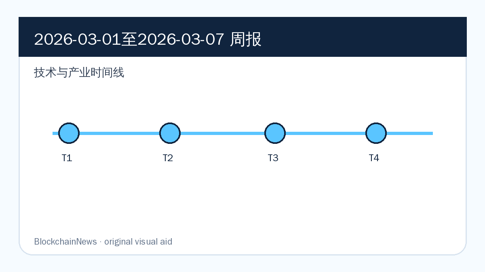
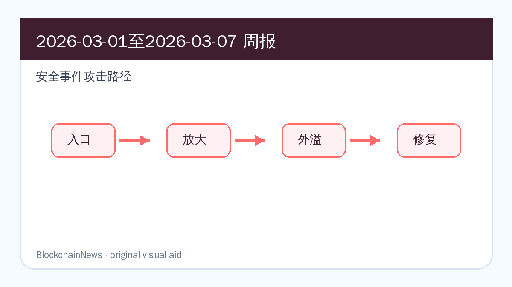
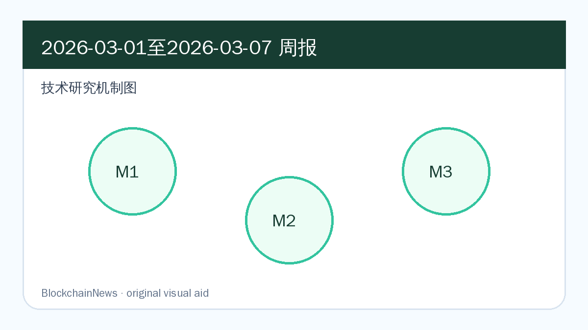

# 区块链周报（2026-03-01 至 2026-03-07）

## 导读

- OpenZeppelin 复核 EVMbench，把 AI 智能合约安全评测从榜单争论拉回数据质量与可复现性。
- Chainalysis 的伊朗资金流与 2026 加密犯罪报告显示，stablecoin 和交易所流动性已经成为地缘冲突里的链上压力计。
- Ethereum 执行层简化与基金会安全优先级，为 3 月后续 Pectra、客户端与账户抽象议题埋下主线。

*图：原创示意图，基于本期周报内容整理，用于辅助理解技术与产业时间线。*

*图：原创示意图，基于本期周报内容整理，用于辅助理解安全事件攻击路径。*

*图：原创示意图，基于本期周报内容整理，用于辅助理解技术研究机制。*

## 区块链技术与产业

### Ethereum 执行层简化讨论重新指向证明效率与客户端可维护性

**来源：** [Ethereum Magicians](https://ethereum-magicians.org/) | 2026-03-07

Ethereum Magicians 的材料显示，「Ethereum 执行层简化讨论重新指向证明效率与客户端可维护性」是本周区块链生态中值得保留的一条结构性信号：它连接了协议工程、链上数据和外部制度环境。

工程层面，这类进展会改变基础设施团队的优先级：开发者要评估接口是否稳定，机构要评估托管、质押、KYT 或支付链路是否能纳入既有系统，协议方则要判断这些变化会不会改变用户流量和资产沉淀方式。

后续重点看项目方是否给出产品接口、客户端实现、治理提案或集成案例；如果只有概念发布而没有可复现技术细节，这条线索的权重应下调。

### Ethereum Foundation 将安全主线前置到 2026 年路线图

**来源：** [Ethereum Foundation Blog](https://blog.ethereum.org/) | 2026-03-07

Ethereum Foundation Blog 的材料显示，「Ethereum Foundation 将安全主线前置到 2026 年路线图」是本周区块链生态中值得保留的一条结构性信号：它连接了协议工程、链上数据和外部制度环境。

工程层面，这类进展会改变基础设施团队的优先级：开发者要评估接口是否稳定，机构要评估托管、质押、KYT 或支付链路是否能纳入既有系统，协议方则要判断这些变化会不会改变用户流量和资产沉淀方式。

后续重点看项目方是否给出产品接口、客户端实现、治理提案或集成案例；如果只有概念发布而没有可复现技术细节，这条线索的权重应下调。

### OpenAI EVMbench 发布后，智能合约 AI 评测进入方法论复核阶段

**来源：** [OpenAI](https://openai.com/index/introducing-evmbench/) | 2026-03-01

OpenAI 相关材料让「OpenAI EVMbench 发布后，智能合约 AI 评测进入方法论复核阶段」成为智能合约安全自动化的一个校准案例。这里的关键不是模型或榜单输赢，而是评测数据、审计流程和可复现性是否足以支撑真实安全决策。

工程层面，这类进展会改变基础设施团队的优先级：开发者要评估接口是否稳定，机构要评估托管、质押、KYT 或支付链路是否能纳入既有系统，协议方则要判断这些变化会不会改变用户流量和资产沉淀方式。

后续重点看项目方是否给出产品接口、客户端实现、治理提案或集成案例；如果只有概念发布而没有可复现技术细节，这条线索的权重应下调。

## 区块链安全

### OpenZeppelin 审计 EVMbench，指出 AI 合约安全基准存在数据质量问题

**来源：** [OpenZeppelin](https://www.openzeppelin.com/news/openai-evmbench-audit) | 2026-03-02

OpenZeppelin 相关材料让「OpenZeppelin 审计 EVMbench，指出 AI 合约安全基准存在数据质量问题」成为智能合约安全自动化的一个校准案例。这里的关键不是模型或榜单输赢，而是评测数据、审计流程和可复现性是否足以支撑真实安全决策。

安全层面，风险往往不只来自一个合约函数。价格源、前端、权限密钥、签名授权、跨链消息和链上归因工具会同时参与风险传导；把它写入周报，是为了留下可复查的防御线索。

后续重点看攻击资金、补丁、审计报告和受影响用户统计是否更新；若复盘只停留在归因层面，仍需要等待更具体的根因和缓解措施。

### Chainalysis 追踪伊朗交易所资金外流，链上压力测试进入地缘冲突场景

**来源：** [Chainalysis](https://www.chainalysis.com/blog/iranian-crypto-outflows-spike-after-airstrikes/) | 2026-03-03

Chainalysis 的原始材料把「Chainalysis 追踪伊朗交易所资金外流，链上压力测试进入地缘冲突场景」放在链上数据、合规调查和机构工作流的交叉处：它提供的不是单一新闻点，而是一组可被交易所、钱包、银行或执法团队复用的链上观察信号。

安全层面，风险往往不只来自一个合约函数。价格源、前端、权限密钥、签名授权、跨链消息和链上归因工具会同时参与风险传导；把它写入周报，是为了留下可复查的防御线索。

后续重点看攻击资金、补丁、审计报告和受影响用户统计是否更新；若复盘只停留在归因层面，仍需要等待更具体的根因和缓解措施。

### Chainalysis 2026 加密犯罪报告显示制裁规避交易量激增 694%

**来源：** [Chainalysis](https://www.chainalysis.com/blog/crypto-sanctions-2026/) | 2026-03-05

Chainalysis 的原始材料把「Chainalysis 2026 加密犯罪报告显示制裁规避交易量激增 694%」放在链上数据、合规调查和机构工作流的交叉处：它提供的不是单一新闻点，而是一组可被交易所、钱包、银行或执法团队复用的链上观察信号。

安全层面，风险往往不只来自一个合约函数。价格源、前端、权限密钥、签名授权、跨链消息和链上归因工具会同时参与风险传导；把它写入周报，是为了留下可复查的防御线索。

后续重点看攻击资金、补丁、审计报告和受影响用户统计是否更新；若复盘只停留在归因层面，仍需要等待更具体的根因和缓解措施。

## 区块链与社会

### 伊朗链上资金外流显示加密资产正在被纳入地缘冲突叙事

**来源：** [Chainalysis](https://www.chainalysis.com/blog/iranian-crypto-outflows-spike-after-airstrikes/) | 2026-03-03

Chainalysis 的原始材料把「伊朗链上资金外流显示加密资产正在被纳入地缘冲突叙事」放在链上数据、合规调查和机构工作流的交叉处：它提供的不是单一新闻点，而是一组可被交易所、钱包、银行或执法团队复用的链上观察信号。

社会与监管层面，这类消息说明加密资产不再只在交易场景里被讨论。司法管辖、制裁执行、消费者保护、AI 信息分发和银行合规都会反过来改变链上产品的设计边界。

后续重点看监管文本、执法行动或平台规则是否真正落地；如果只是会议发言或市场预期，需要和后续制度动作分开记录。

### AI 参与智能合约审计引发责任边界讨论

**来源：** [OpenZeppelin](https://www.openzeppelin.com/news/openai-evmbench-audit) | 2026-03-02

OpenZeppelin 相关材料让「AI 参与智能合约审计引发责任边界讨论」成为智能合约安全自动化的一个校准案例。这里的关键不是模型或榜单输赢，而是评测数据、审计流程和可复现性是否足以支撑真实安全决策。

社会与监管层面，这类消息说明加密资产不再只在交易场景里被讨论。司法管辖、制裁执行、消费者保护、AI 信息分发和银行合规都会反过来改变链上产品的设计边界。

后续重点看监管文本、执法行动或平台规则是否真正落地；如果只是会议发言或市场预期，需要和后续制度动作分开记录。

### 制裁规避数据把稳定币发行方推到监管前线

**来源：** [Chainalysis](https://www.chainalysis.com/blog/crypto-sanctions-2026/) | 2026-03-05

Chainalysis 的原始材料把「制裁规避数据把稳定币发行方推到监管前线」放在链上数据、合规调查和机构工作流的交叉处：它提供的不是单一新闻点，而是一组可被交易所、钱包、银行或执法团队复用的链上观察信号。

社会与监管层面，这类消息说明加密资产不再只在交易场景里被讨论。司法管辖、制裁执行、消费者保护、AI 信息分发和银行合规都会反过来改变链上产品的设计边界。

后续重点看监管文本、执法行动或平台规则是否真正落地；如果只是会议发言或市场预期，需要和后续制度动作分开记录。

## 加密市场与宏观

### 伊朗冲突后的 crypto outflows 体现 stablecoin 避险与流动性转移

**来源：** [Chainalysis](https://www.chainalysis.com/blog/iranian-crypto-outflows-spike-after-airstrikes/) | 2026-03-03

Chainalysis 的原始材料把「伊朗冲突后的 crypto outflows 体现 stablecoin 避险与流动性转移」放在链上数据、合规调查和机构工作流的交叉处：它提供的不是单一新闻点，而是一组可被交易所、钱包、银行或执法团队复用的链上观察信号。

市场层面，这类信号影响的是资金如何进入数字资产：ETF、企业财库、稳定币结算、矿企算力迁移和机构合规成本，都会改变 BTC、ETH 与 stablecoin 的定价叙事。

后续重点看资金流和链上使用是否同步。如果价格或融资数据没有对应的链上活跃度、储备披露或产品采用，宏观叙事可能很快退回短期波动。

### 制裁交易量增长改变 crypto market 风险定价

**来源：** [Chainalysis](https://www.chainalysis.com/blog/crypto-sanctions-2026/) | 2026-03-05

Chainalysis 的原始材料把「制裁交易量增长改变 crypto market 风险定价」放在链上数据、合规调查和机构工作流的交叉处：它提供的不是单一新闻点，而是一组可被交易所、钱包、银行或执法团队复用的链上观察信号。

市场层面，这类信号影响的是资金如何进入数字资产：ETF、企业财库、稳定币结算、矿企算力迁移和机构合规成本，都会改变 BTC、ETH 与 stablecoin 的定价叙事。

后续重点看资金流和链上使用是否同步。如果价格或融资数据没有对应的链上活跃度、储备披露或产品采用，宏观叙事可能很快退回短期波动。

### EVMbench 争议影响 AI smart contract security 工具赛道估值逻辑

**来源：** [OpenAI](https://openai.com/index/introducing-evmbench/) | 2026-03-01

OpenAI 相关材料让「EVMbench 争议影响 AI smart contract security 工具赛道估值逻辑」成为智能合约安全自动化的一个校准案例。这里的关键不是模型或榜单输赢，而是评测数据、审计流程和可复现性是否足以支撑真实安全决策。

市场层面，这类信号影响的是资金如何进入数字资产：ETF、企业财库、稳定币结算、矿企算力迁移和机构合规成本，都会改变 BTC、ETH 与 stablecoin 的定价叙事。

后续重点看资金流和链上使用是否同步。如果价格或融资数据没有对应的链上活跃度、储备披露或产品采用，宏观叙事可能很快退回短期波动。

## 技术研究

### 《Why Ethereum Needs Fairness Mechanisms that Do Not Depend on Participant Altruism》

- 原文链接：https://arxiv.org/abs/2603.05666
- 原始发表：2026-03-06
- 摘要速写：Ethereum 公平机制研究把验证者利他假设替换为可验证约束，讨论 MEV 与交易排序在协议层如何被更稳健地约束。
- 核心贡献：
  - 明确研究对象与 blockchain / Ethereum / DeFi / stablecoin 系统边界，避免把泛安全议题误放进技术研究。
  - 拆分协议机制、攻击路径、链上数据或合规流程之间的因果关系。
  - 给开发者、安全团队、研究者或机构采用方提供可继续验证的技术问题清单。

#### 背景与问题

Why Ethereum Needs Fairness Mechanisms that Do Not Depend on Participant Altruism 被放入技术研究，不是因为标题里出现了区块链关键词，而是因为它直接触及链上系统的一个可验证问题：排序公平性、合约分析、身份与钱包、资金追踪、MEV、stablecoin 监控或机构级合规工作流。周报关注的是这些问题如何在真实协议和真实用户路径中发生，而不是只复述 abstract。

#### 方法/机制

原文的价值在于把研究对象拆成可操作的机制：要么用链上数据或图模型观察行为，要么用算法、审计框架、合规流程或市场结构解释风险如何形成。阅读时需要同时看三个层面：数据从哪里来，假设是否贴近主网或生产环境，结论能否被钱包、审计、交易路由、KYT 或治理流程吸收。

#### 关键发现

最值得保留的发现，是它把单点问题放回了系统结构中：协议设计会影响经济激励，链上数据质量会影响调查结论，工具链能力会影响开发者能否发现风险。对周报读者来说，这类研究的意义在于提供一个可迁移的分析框架，而不是只给出某个样本上的分数。

#### 局限与后续

后续应优先检查原文是否公开代码、数据集、复现实验或反驳材料，并观察项目方是否把结论转化为客户端补丁、审计规则、钱包提示、KYT 策略或治理提案。若缺少可复现材料，它更适合作为问题线索，而不是直接升级为行业结论。

### 《Blockchain Communication Vulnerabilities》

- 原文链接：https://arxiv.org/abs/2603.02661
- 原始发表：2026-03-03
- 摘要速写：Blockchain 通信脆弱性研究把多链消息传播、P2P 连接和跨链依赖放进同一测量框架，解释攻击如何从网络层外溢到资产层。
- 核心贡献：
  - 明确研究对象与 blockchain / Ethereum / DeFi / stablecoin 系统边界，避免把泛安全议题误放进技术研究。
  - 拆分协议机制、攻击路径、链上数据或合规流程之间的因果关系。
  - 给开发者、安全团队、研究者或机构采用方提供可继续验证的技术问题清单。

#### 背景与问题

Blockchain Communication Vulnerabilities 被放入技术研究，不是因为标题里出现了区块链关键词，而是因为它直接触及链上系统的一个可验证问题：排序公平性、合约分析、身份与钱包、资金追踪、MEV、stablecoin 监控或机构级合规工作流。周报关注的是这些问题如何在真实协议和真实用户路径中发生，而不是只复述 abstract。

#### 方法/机制

原文的价值在于把研究对象拆成可操作的机制：要么用链上数据或图模型观察行为，要么用算法、审计框架、合规流程或市场结构解释风险如何形成。阅读时需要同时看三个层面：数据从哪里来，假设是否贴近主网或生产环境，结论能否被钱包、审计、交易路由、KYT 或治理流程吸收。

#### 关键发现

最值得保留的发现，是它把单点问题放回了系统结构中：协议设计会影响经济激励，链上数据质量会影响调查结论，工具链能力会影响开发者能否发现风险。对周报读者来说，这类研究的意义在于提供一个可迁移的分析框架，而不是只给出某个样本上的分数。

#### 局限与后续

后续应优先检查原文是否公开代码、数据集、复现实验或反驳材料，并观察项目方是否把结论转化为客户端补丁、审计规则、钱包提示、KYT 策略或治理提案。若缺少可复现材料，它更适合作为问题线索，而不是直接升级为行业结论。

### 《SoK: Self-Sovereign Digital Identities》

- 原文链接：https://arxiv.org/abs/2603.06896
- 原始发表：2026-03-06
- 摘要速写：Self-Sovereign Identity 综述把 DID、凭证、钱包和链上锚定关系重新分层，适合评估 Web3 身份系统的真实去中心化程度。
- 核心贡献：
  - 明确研究对象与 blockchain / Ethereum / DeFi / stablecoin 系统边界，避免把泛安全议题误放进技术研究。
  - 拆分协议机制、攻击路径、链上数据或合规流程之间的因果关系。
  - 给开发者、安全团队、研究者或机构采用方提供可继续验证的技术问题清单。

#### 背景与问题

SoK 被放入技术研究，不是因为标题里出现了区块链关键词，而是因为它直接触及链上系统的一个可验证问题：排序公平性、合约分析、身份与钱包、资金追踪、MEV、stablecoin 监控或机构级合规工作流。周报关注的是这些问题如何在真实协议和真实用户路径中发生，而不是只复述 abstract。

#### 方法/机制

原文的价值在于把研究对象拆成可操作的机制：要么用链上数据或图模型观察行为，要么用算法、审计框架、合规流程或市场结构解释风险如何形成。阅读时需要同时看三个层面：数据从哪里来，假设是否贴近主网或生产环境，结论能否被钱包、审计、交易路由、KYT 或治理流程吸收。

#### 关键发现

最值得保留的发现，是它把单点问题放回了系统结构中：协议设计会影响经济激励，链上数据质量会影响调查结论，工具链能力会影响开发者能否发现风险。对周报读者来说，这类研究的意义在于提供一个可迁移的分析框架，而不是只给出某个样本上的分数。

#### 局限与后续

后续应优先检查原文是否公开代码、数据集、复现实验或反驳材料，并观察项目方是否把结论转化为客户端补丁、审计规则、钱包提示、KYT 策略或治理提案。若缺少可复现材料，它更适合作为问题线索，而不是直接升级为行业结论。

## 后续关注

- 跟踪 Ethereum、Rollup、stablecoin、DeFi 安全和链上情报主线是否出现新的官方公告或事故复盘。
- 对安全事件只报道新增事实，避免把同一资金流、同一漏洞复盘或同一研究链接重复包装成新事件。
- 技术研究优先回到原文、数据集和代码仓库，确认是否有后续版本、复测或反驳。
