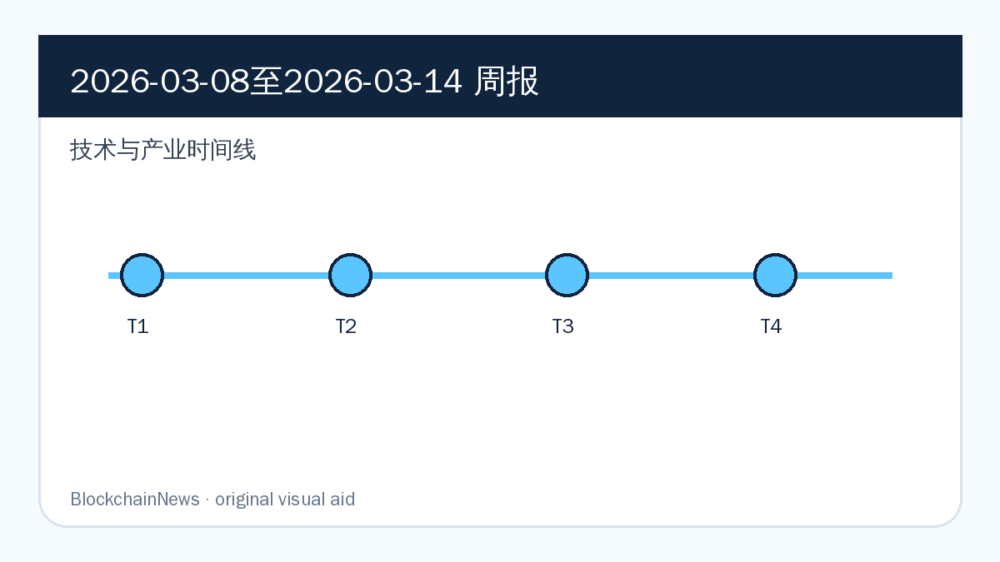
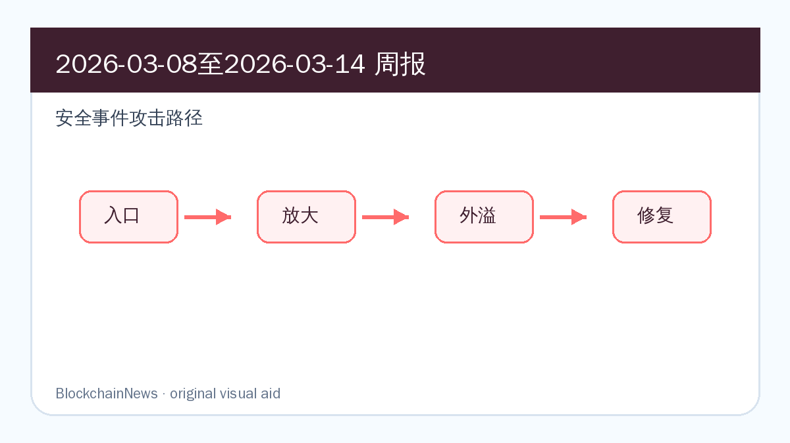
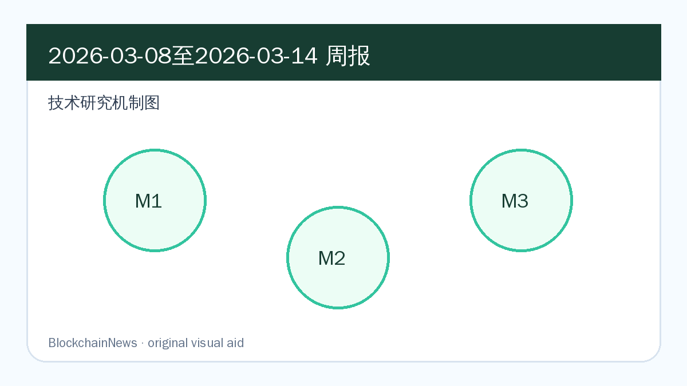

# 区块链周报（2026-03-08 至 2026-03-14）

## 导读

- Pectra、机构级 restaking、stablecoin 监管和 RWA 安全共同构成本周技术与合规主线。
- 安全事件从单点合约漏洞扩展到 oracle 配置、金库参数和设备入侵。
- 技术研究以 AI 合约审计、Rug Pull 检测、MEV 与 ZK 证明编排为核心。

*图：原创示意图，基于本期周报内容整理，用于辅助理解技术与产业时间线。*

*图：原创示意图，基于本期周报内容整理，用于辅助理解安全事件攻击路径。*

*图：原创示意图，基于本期周报内容整理，用于辅助理解技术研究机制。*

## 区块链技术与产业

### Ethereum Pectra 主网部署进入倒计时，账户抽象与验证者合并成为核心看点

**来源：** [Consensys](https://consensys.io/blog/ethereum-pectra-upgrade) | 2026-03-10

Consensys 的材料显示，「Ethereum Pectra 主网部署进入倒计时，账户抽象与验证者合并成为核心看点」是本周区块链生态中值得保留的一条结构性信号：它连接了协议工程、链上数据和外部制度环境。

工程层面，这类进展会改变基础设施团队的优先级：开发者要评估接口是否稳定，机构要评估托管、质押、KYT 或支付链路是否能纳入既有系统，协议方则要判断这些变化会不会改变用户流量和资产沉淀方式。

后续重点看项目方是否给出产品接口、客户端实现、治理提案或集成案例；如果只有概念发布而没有可复现技术细节，这条线索的权重应下调。

### Anchorage 接入 Puffer，机构级 ETH restaking 进入托管账户流程

**来源：** [Cointelegraph](https://cointelegraph.com/news/anchorage-digital-integrates-puffer-finance-to-offer-institutional-ethereum-restaking) | 2026-03-12

Cointelegraph 的报道显示，「Anchorage 接入 Puffer，机构级 ETH restaking 进入托管账户流程」已经从单个项目动态外溢为更大的市场结构变化。真正值得记录的是事件背后的资金、监管或协议接口，而不是标题里的短期情绪。

工程层面，这类进展会改变基础设施团队的优先级：开发者要评估接口是否稳定，机构要评估托管、质押、KYT 或支付链路是否能纳入既有系统，协议方则要判断这些变化会不会改变用户流量和资产沉淀方式。

后续重点看项目方是否给出产品接口、客户端实现、治理提案或集成案例；如果只有概念发布而没有可复现技术细节，这条线索的权重应下调。

### Tether 投资 Ark Labs，把 stablecoin 基础设施继续压向 Bitcoin 生态

**来源：** [Cointelegraph](https://cointelegraph.com/news/tether-backs-ark-labs-in-5-2m-round-to-build-stablecoin-infrastructure-on-bitcoin) | 2026-03-12

Cointelegraph 的报道显示，「Tether 投资 Ark Labs，把 stablecoin 基础设施继续压向 Bitcoin 生态」已经从单个项目动态外溢为更大的市场结构变化。真正值得记录的是事件背后的资金、监管或协议接口，而不是标题里的短期情绪。

工程层面，这类进展会改变基础设施团队的优先级：开发者要评估接口是否稳定，机构要评估托管、质押、KYT 或支付链路是否能纳入既有系统，协议方则要判断这些变化会不会改变用户流量和资产沉淀方式。

后续重点看项目方是否给出产品接口、客户端实现、治理提案或集成案例；如果只有概念发布而没有可复现技术细节，这条线索的权重应下调。

## 区块链安全

### Solv BRO 金库漏洞造成约 273 万美元损失，DeFi 金库参数暴露复合风险

**来源：** [Rekt](https://rekt.news/zh/solv-rekt) | 2026-03-10

Rekt 的事故复盘把「Solv BRO 金库漏洞造成约 273 万美元损失，DeFi 金库参数暴露复合风险」拆成了可复查的攻击路径：触发点、放大路径和修复动作都比单纯损失金额更有参考价值。

安全层面，风险往往不只来自一个合约函数。价格源、前端、权限密钥、签名授权、跨链消息和链上归因工具会同时参与风险传导；把它写入周报，是为了留下可复查的防御线索。

后续重点看攻击资金、补丁、审计报告和受影响用户统计是否更新；若复盘只停留在归因层面，仍需要等待更具体的根因和缓解措施。

### FoomCash 零知识验证器配置缺陷导致约 226 万美元损失

**来源：** [Rekt](https://rekt.news/zh/the-unfinished-proof) | 2026-03-10

Rekt 的事故复盘把「FoomCash 零知识验证器配置缺陷导致约 226 万美元损失」拆成了可复查的攻击路径：触发点、放大路径和修复动作都比单纯损失金额更有参考价值。

安全层面，风险往往不只来自一个合约函数。价格源、前端、权限密钥、签名授权、跨链消息和链上归因工具会同时参与风险传导；把它写入周报，是为了留下可复查的防御线索。

后续重点看攻击资金、补丁、审计报告和受影响用户统计是否更新；若复盘只停留在归因层面，仍需要等待更具体的根因和缓解措施。

### Moonwell oracle 配置错误引发约 178 万美元损失

**来源：** [Rekt](https://rekt.news/zh/moonwell-rekt) | 2026-03-10

Rekt 的事故复盘把「Moonwell oracle 配置错误引发约 178 万美元损失」拆成了可复查的攻击路径：触发点、放大路径和修复动作都比单纯损失金额更有参考价值。

安全层面，风险往往不只来自一个合约函数。价格源、前端、权限密钥、签名授权、跨链消息和链上归因工具会同时参与风险传导；把它写入周报，是为了留下可复查的防御线索。

后续重点看攻击资金、补丁、审计报告和受影响用户统计是否更新；若复盘只停留在归因层面，仍需要等待更具体的根因和缓解措施。

## 区块链与社会

### FATF stablecoin 报告把监管焦点推向二级市场监控

**来源：** [Chainalysis](https://www.chainalysis.com/blog/fatf-targeted-report-secondary-market-monitoring-stablecoins-march-2026/) | 2026-03-11

Chainalysis 的原始材料把「FATF stablecoin 报告把监管焦点推向二级市场监控」放在链上数据、合规调查和机构工作流的交叉处：它提供的不是单一新闻点，而是一组可被交易所、钱包、银行或执法团队复用的链上观察信号。

社会与监管层面，这类消息说明加密资产不再只在交易场景里被讨论。司法管辖、制裁执行、消费者保护、AI 信息分发和银行合规都会反过来改变链上产品的设计边界。

后续重点看监管文本、执法行动或平台规则是否真正落地；如果只是会议发言或市场预期，需要和后续制度动作分开记录。

### Tornado Cash 相关诉讼延续隐私工具法律边界争论

**来源：** [CourtListener](https://www.courtlistener.com/) | 2026-03-12

CourtListener 的材料显示，「Tornado Cash 相关诉讼延续隐私工具法律边界争论」是本周区块链生态中值得保留的一条结构性信号：它连接了协议工程、链上数据和外部制度环境。

社会与监管层面，这类消息说明加密资产不再只在交易场景里被讨论。司法管辖、制裁执行、消费者保护、AI 信息分发和银行合规都会反过来改变链上产品的设计边界。

后续重点看监管文本、执法行动或平台规则是否真正落地；如果只是会议发言或市场预期，需要和后续制度动作分开记录。

### 稳定币州级监管实践继续推进，地方规则与联邦框架出现竞合

**来源：** [Cointelegraph](https://cointelegraph.com/news/stablecoin-state-regulation-framework) | 2026-03-12

Cointelegraph 的报道显示，「稳定币州级监管实践继续推进，地方规则与联邦框架出现竞合」已经从单个项目动态外溢为更大的市场结构变化。真正值得记录的是事件背后的资金、监管或协议接口，而不是标题里的短期情绪。

社会与监管层面，这类消息说明加密资产不再只在交易场景里被讨论。司法管辖、制裁执行、消费者保护、AI 信息分发和银行合规都会反过来改变链上产品的设计边界。

后续重点看监管文本、执法行动或平台规则是否真正落地；如果只是会议发言或市场预期，需要和后续制度动作分开记录。

## 加密市场与宏观

### 现货 Bitcoin ETF 出现连续净流入，机构配置情绪修复

**来源：** [Cointelegraph](https://cointelegraph.com/news/spot-bitcoin-etfs-five-day-inflow-streak-2026) | 2026-03-14

Cointelegraph 的报道显示，「现货 Bitcoin ETF 出现连续净流入，机构配置情绪修复」已经从单个项目动态外溢为更大的市场结构变化。真正值得记录的是事件背后的资金、监管或协议接口，而不是标题里的短期情绪。

市场层面，这类信号影响的是资金如何进入数字资产：ETF、企业财库、稳定币结算、矿企算力迁移和机构合规成本，都会改变 BTC、ETH 与 stablecoin 的定价叙事。

后续重点看资金流和链上使用是否同步。如果价格或融资数据没有对应的链上活跃度、储备披露或产品采用，宏观叙事可能很快退回短期波动。

### Druckenmiller 讨论 stablecoin 全球支付潜力，传统金融开始重估结算层

**来源：** [Cointelegraph](https://cointelegraph.com/news/stablecoins-power-global-payments-10-years-stanley-druckenmiller) | 2026-03-14

Cointelegraph 的报道显示，「Druckenmiller 讨论 stablecoin 全球支付潜力，传统金融开始重估结算层」已经从单个项目动态外溢为更大的市场结构变化。真正值得记录的是事件背后的资金、监管或协议接口，而不是标题里的短期情绪。

市场层面，这类信号影响的是资金如何进入数字资产：ETF、企业财库、稳定币结算、矿企算力迁移和机构合规成本，都会改变 BTC、ETH 与 stablecoin 的定价叙事。

后续重点看资金流和链上使用是否同步。如果价格或融资数据没有对应的链上活跃度、储备披露或产品采用，宏观叙事可能很快退回短期波动。

### Perp DEX 成为公链争夺新战场，流动性结构比单纯 TPS 更关键

**来源：** [Cointelegraph](https://cointelegraph.com/features/perp-dexs-become-the-latest-battleground-for-blockchains) | 2026-03-12

Cointelegraph 的报道显示，「Perp DEX 成为公链争夺新战场，流动性结构比单纯 TPS 更关键」已经从单个项目动态外溢为更大的市场结构变化。真正值得记录的是事件背后的资金、监管或协议接口，而不是标题里的短期情绪。

市场层面，这类信号影响的是资金如何进入数字资产：ETF、企业财库、稳定币结算、矿企算力迁移和机构合规成本，都会改变 BTC、ETH 与 stablecoin 的定价叙事。

后续重点看资金流和链上使用是否同步。如果价格或融资数据没有对应的链上活跃度、储备披露或产品采用，宏观叙事可能很快退回短期波动。

## 技术研究

### 《LROO Rug Pull Detector: A Leakage-Resistant Framework Based on On-Chain and OSINT Signals》

- 原文链接：https://arxiv.org/abs/2603.11324
- 原始发表：2026-03-11
- 摘要速写：LROO 把链上行为和 OSINT 信号合并到 Rug Pull 预警框架中，重点解决标签泄漏与早期预警之间的冲突。
- 核心贡献：
  - 明确研究对象与 blockchain / Ethereum / DeFi / stablecoin 系统边界，避免把泛安全议题误放进技术研究。
  - 拆分协议机制、攻击路径、链上数据或合规流程之间的因果关系。
  - 给开发者、安全团队、研究者或机构采用方提供可继续验证的技术问题清单。

#### 背景与问题

LROO Rug Pull Detector 被放入技术研究，不是因为标题里出现了区块链关键词，而是因为它直接触及链上系统的一个可验证问题：排序公平性、合约分析、身份与钱包、资金追踪、MEV、stablecoin 监控或机构级合规工作流。周报关注的是这些问题如何在真实协议和真实用户路径中发生，而不是只复述 abstract。

#### 方法/机制

原文的价值在于把研究对象拆成可操作的机制：要么用链上数据或图模型观察行为，要么用算法、审计框架、合规流程或市场结构解释风险如何形成。阅读时需要同时看三个层面：数据从哪里来，假设是否贴近主网或生产环境，结论能否被钱包、审计、交易路由、KYT 或治理流程吸收。

#### 关键发现

最值得保留的发现，是它把单点问题放回了系统结构中：协议设计会影响经济激励，链上数据质量会影响调查结论，工具链能力会影响开发者能否发现风险。对周报读者来说，这类研究的意义在于提供一个可迁移的分析框架，而不是只给出某个样本上的分数。

#### 局限与后续

后续应优先检查原文是否公开代码、数据集、复现实验或反驳材料，并观察项目方是否把结论转化为客户端补丁、审计规则、钱包提示、KYT 策略或治理提案。若缺少可复现材料，它更适合作为问题线索，而不是直接升级为行业结论。

### 《ACE Runtime: Toward Sub-Second Cryptographic Finality in ZKP-Native Blockchains》

- 原文链接：https://arxiv.org/abs/2603.10242
- 原始发表：2026-03-10
- 摘要速写：ACE Runtime 以 ZKP-native blockchain 为对象，讨论如何把密码学终局性、执行环境和低延迟证明管线放入同一运行时。
- 核心贡献：
  - 明确研究对象与 blockchain / Ethereum / DeFi / stablecoin 系统边界，避免把泛安全议题误放进技术研究。
  - 拆分协议机制、攻击路径、链上数据或合规流程之间的因果关系。
  - 给开发者、安全团队、研究者或机构采用方提供可继续验证的技术问题清单。

#### 背景与问题

ACE Runtime 被放入技术研究，不是因为标题里出现了区块链关键词，而是因为它直接触及链上系统的一个可验证问题：排序公平性、合约分析、身份与钱包、资金追踪、MEV、stablecoin 监控或机构级合规工作流。周报关注的是这些问题如何在真实协议和真实用户路径中发生，而不是只复述 abstract。

#### 方法/机制

原文的价值在于把研究对象拆成可操作的机制：要么用链上数据或图模型观察行为，要么用算法、审计框架、合规流程或市场结构解释风险如何形成。阅读时需要同时看三个层面：数据从哪里来，假设是否贴近主网或生产环境，结论能否被钱包、审计、交易路由、KYT 或治理流程吸收。

#### 关键发现

最值得保留的发现，是它把单点问题放回了系统结构中：协议设计会影响经济激励，链上数据质量会影响调查结论，工具链能力会影响开发者能否发现风险。对周报读者来说，这类研究的意义在于提供一个可迁移的分析框架，而不是只给出某个样本上的分数。

#### 局限与后续

后续应优先检查原文是否公开代码、数据集、复现实验或反驳材料，并观察项目方是否把结论转化为客户端补丁、审计规则、钱包提示、KYT 策略或治理提案。若缺少可复现材料，它更适合作为问题线索，而不是直接升级为行业结论。

### 《SoK: The Evolution of Maximal Extractable Value》

- 原文链接：https://arxiv.org/abs/2603.07716
- 原始发表：2026-03-08
- 摘要速写：MEV 综述把矿工时代、验证者时代、PBS 与跨链交易路径串联起来，解释价值抽取如何从排序问题演化成市场结构问题。
- 核心贡献：
  - 明确研究对象与 blockchain / Ethereum / DeFi / stablecoin 系统边界，避免把泛安全议题误放进技术研究。
  - 拆分协议机制、攻击路径、链上数据或合规流程之间的因果关系。
  - 给开发者、安全团队、研究者或机构采用方提供可继续验证的技术问题清单。

#### 背景与问题

SoK 被放入技术研究，不是因为标题里出现了区块链关键词，而是因为它直接触及链上系统的一个可验证问题：排序公平性、合约分析、身份与钱包、资金追踪、MEV、stablecoin 监控或机构级合规工作流。周报关注的是这些问题如何在真实协议和真实用户路径中发生，而不是只复述 abstract。

#### 方法/机制

原文的价值在于把研究对象拆成可操作的机制：要么用链上数据或图模型观察行为，要么用算法、审计框架、合规流程或市场结构解释风险如何形成。阅读时需要同时看三个层面：数据从哪里来，假设是否贴近主网或生产环境，结论能否被钱包、审计、交易路由、KYT 或治理流程吸收。

#### 关键发现

最值得保留的发现，是它把单点问题放回了系统结构中：协议设计会影响经济激励，链上数据质量会影响调查结论，工具链能力会影响开发者能否发现风险。对周报读者来说，这类研究的意义在于提供一个可迁移的分析框架，而不是只给出某个样本上的分数。

#### 局限与后续

后续应优先检查原文是否公开代码、数据集、复现实验或反驳材料，并观察项目方是否把结论转化为客户端补丁、审计规则、钱包提示、KYT 策略或治理提案。若缺少可复现材料，它更适合作为问题线索，而不是直接升级为行业结论。

## 后续关注

- 跟踪 Ethereum、Rollup、stablecoin、DeFi 安全和链上情报主线是否出现新的官方公告或事故复盘。
- 对安全事件只报道新增事实，避免把同一资金流、同一漏洞复盘或同一研究链接重复包装成新事件。
- 技术研究优先回到原文、数据集和代码仓库，确认是否有后续版本、复测或反驳。
