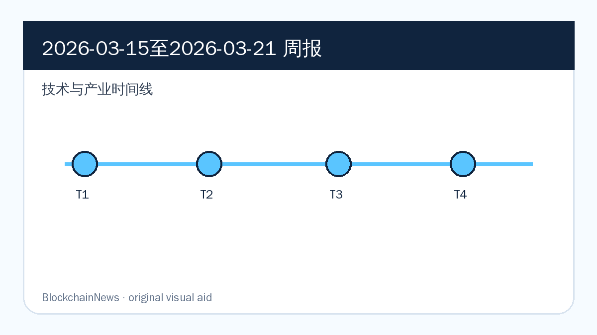
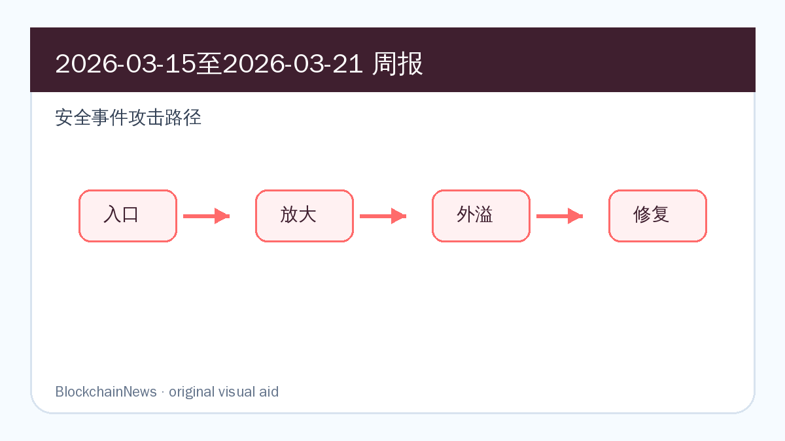
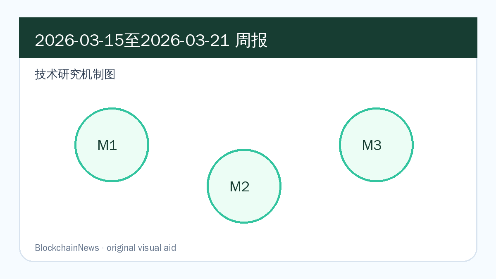

# 区块链周报（2026-03-15 至 2026-03-21）

## 导读

- Ethereum 机构化、企业财库和质押产品继续推进，但 DeFi 风险参数事件提醒协议复杂度正在上升。
- 安全栏目主线从单纯漏洞转向 oracle、前端、AML 与跨境诈骗网络的复合治理。
- 技术研究覆盖以太坊铭文、Solana 符号执行、MEV 拍卖、用户意图和 Sedna 共识激励。

*图：原创示意图，基于本期周报内容整理，用于辅助理解技术与产业时间线。*

*图：原创示意图，基于本期周报内容整理，用于辅助理解安全事件攻击路径。*

*图：原创示意图，基于本期周报内容整理，用于辅助理解技术研究机制。*

## 区块链技术与产业

### Bitmine 增持 ETH，企业级 Ethereum 财库叙事延续

**来源：** [Cointelegraph](https://cointelegraph.com/news/bitmine-buys-5-000-eth-from-ethereum-foundation-brings-holdings-to-4-6m-tokens) | 2026-03-16

Cointelegraph 的报道显示，「Bitmine 增持 ETH，企业级 Ethereum 财库叙事延续」已经从单个项目动态外溢为更大的市场结构变化。真正值得记录的是事件背后的资金、监管或协议接口，而不是标题里的短期情绪。

工程层面，这类进展会改变基础设施团队的优先级：开发者要评估接口是否稳定，机构要评估托管、质押、KYT 或支付链路是否能纳入既有系统，协议方则要判断这些变化会不会改变用户流量和资产沉淀方式。

后续重点看项目方是否给出产品接口、客户端实现、治理提案或集成案例；如果只有概念发布而没有可复现技术细节，这条线索的权重应下调。

### Strategy 再买 22337 枚 BTC，企业财库继续吸收 Bitcoin 流通供给

**来源：** [Cointelegraph](https://cointelegraph.com/news/strategy-1-6-billion-bitcoin-buy-holdings-top-761k-btc) | 2026-03-16

Cointelegraph 的报道显示，「Strategy 再买 22337 枚 BTC，企业财库继续吸收 Bitcoin 流通供给」已经从单个项目动态外溢为更大的市场结构变化。真正值得记录的是事件背后的资金、监管或协议接口，而不是标题里的短期情绪。

工程层面，这类进展会改变基础设施团队的优先级：开发者要评估接口是否稳定，机构要评估托管、质押、KYT 或支付链路是否能纳入既有系统，协议方则要判断这些变化会不会改变用户流量和资产沉淀方式。

后续重点看项目方是否给出产品接口、客户端实现、治理提案或集成案例；如果只有概念发布而没有可复现技术细节，这条线索的权重应下调。

### 香港 stablecoin 牌照预期升温，银行系发行人或率先拿入口

**来源：** [Cointelegraph](https://cointelegraph.com/news/hsbc-standard-chartered-hong-kong-stablecoin-report) | 2026-03-16

Cointelegraph 的报道显示，「香港 stablecoin 牌照预期升温，银行系发行人或率先拿入口」已经从单个项目动态外溢为更大的市场结构变化。真正值得记录的是事件背后的资金、监管或协议接口，而不是标题里的短期情绪。

工程层面，这类进展会改变基础设施团队的优先级：开发者要评估接口是否稳定，机构要评估托管、质押、KYT 或支付链路是否能纳入既有系统，协议方则要判断这些变化会不会改变用户流量和资产沉淀方式。

后续重点看项目方是否给出产品接口、客户端实现、治理提案或集成案例；如果只有概念发布而没有可复现技术细节，这条线索的权重应下调。

## 区块链安全

### Aave 清算事件显示 2.85% 价格偏差也能放大成 2700 万美元损失

**来源：** [Cointelegraph](https://cointelegraph.com/features/how-a-2-85-price-error-triggered-27m-in-liquidations-on-aave) | 2026-03-16

Cointelegraph 的报道显示，「Aave 清算事件显示 2.85% 价格偏差也能放大成 2700 万美元损失」已经从单个项目动态外溢为更大的市场结构变化。真正值得记录的是事件背后的资金、监管或协议接口，而不是标题里的短期情绪。

安全层面，风险往往不只来自一个合约函数。价格源、前端、权限密钥、签名授权、跨链消息和链上归因工具会同时参与风险传导；把它写入周报，是为了留下可复查的防御线索。

后续重点看攻击资金、补丁、审计报告和受影响用户统计是否更新；若复盘只停留在归因层面，仍需要等待更具体的根因和缓解措施。

### Bonk.fun 域名劫持暴露 Solana 前端与钱包交互风险

**来源：** [Cointelegraph](https://cointelegraph.com/news/bonk-fun-domain-hijack-wallet-drainer-solana) | 2026-03-18

Cointelegraph 的报道显示，「Bonk.fun 域名劫持暴露 Solana 前端与钱包交互风险」已经从单个项目动态外溢为更大的市场结构变化。真正值得记录的是事件背后的资金、监管或协议接口，而不是标题里的短期情绪。

安全层面，风险往往不只来自一个合约函数。价格源、前端、权限密钥、签名授权、跨链消息和链上归因工具会同时参与风险传导；把它写入周报，是为了留下可复查的防御线索。

后续重点看攻击资金、补丁、审计报告和受影响用户统计是否更新；若复盘只停留在归因层面，仍需要等待更具体的根因和缓解措施。

### 美英加 Operation Atlantic 联手打击 approval phishing 与 crypto 投资诈骗

**来源：** [Cointelegraph](https://cointelegraph.com/news/us-uk-canada-enforcement-operation-crypto-fraud) | 2026-03-16

Cointelegraph 的报道显示，「美英加 Operation Atlantic 联手打击 approval phishing 与 crypto 投资诈骗」已经从单个项目动态外溢为更大的市场结构变化。真正值得记录的是事件背后的资金、监管或协议接口，而不是标题里的短期情绪。

安全层面，风险往往不只来自一个合约函数。价格源、前端、权限密钥、签名授权、跨链消息和链上归因工具会同时参与风险传导；把它写入周报，是为了留下可复查的防御线索。

后续重点看攻击资金、补丁、审计报告和受影响用户统计是否更新；若复盘只停留在归因层面，仍需要等待更具体的根因和缓解措施。

## 区块链与社会

### 澳大利亚数字资产框架法案获参议院委员会支持

**来源：** [Cointelegraph](https://cointelegraph.com/news/australian-senate-committee-backs-new-crypto-bill) | 2026-03-16

Cointelegraph 的报道显示，「澳大利亚数字资产框架法案获参议院委员会支持」已经从单个项目动态外溢为更大的市场结构变化。真正值得记录的是事件背后的资金、监管或协议接口，而不是标题里的短期情绪。

社会与监管层面，这类消息说明加密资产不再只在交易场景里被讨论。司法管辖、制裁执行、消费者保护、AI 信息分发和银行合规都会反过来改变链上产品的设计边界。

后续重点看监管文本、执法行动或平台规则是否真正落地；如果只是会议发言或市场预期，需要和后续制度动作分开记录。

### 美国 stablecoin 收益分配争议继续外溢到海外市场

**来源：** [Cointelegraph](https://cointelegraph.com/news/us-stablecoin-yield-ban-see-others-fill-void) | 2026-03-16

Cointelegraph 的报道显示，「美国 stablecoin 收益分配争议继续外溢到海外市场」已经从单个项目动态外溢为更大的市场结构变化。真正值得记录的是事件背后的资金、监管或协议接口，而不是标题里的短期情绪。

社会与监管层面，这类消息说明加密资产不再只在交易场景里被讨论。司法管辖、制裁执行、消费者保护、AI 信息分发和银行合规都会反过来改变链上产品的设计边界。

后续重点看监管文本、执法行动或平台规则是否真正落地；如果只是会议发言或市场预期，需要和后续制度动作分开记录。

### 年轻投资者 AI 投顾与 crypto finfluencer 风险引发监管提醒

**来源：** [Cointelegraph](https://cointelegraph.com/news/asic-warns-ai-finfluencers-gen-z-crypto-23-percent) | 2026-03-16

Cointelegraph 的报道显示，「年轻投资者 AI 投顾与 crypto finfluencer 风险引发监管提醒」已经从单个项目动态外溢为更大的市场结构变化。真正值得记录的是事件背后的资金、监管或协议接口，而不是标题里的短期情绪。

社会与监管层面，这类消息说明加密资产不再只在交易场景里被讨论。司法管辖、制裁执行、消费者保护、AI 信息分发和银行合规都会反过来改变链上产品的设计边界。

后续重点看监管文本、执法行动或平台规则是否真正落地；如果只是会议发言或市场预期，需要和后续制度动作分开记录。

## 加密市场与宏观

### 加密 ETP 单周净流入 10.6 亿美元，BTC 与 ETH 继续领跑

**来源：** [Cointelegraph](https://cointelegraph.com/news/crypto-etp-1-billion-inflows-three-straight-weeks-gains) | 2026-03-16

Cointelegraph 的报道显示，「加密 ETP 单周净流入 10.6 亿美元，BTC 与 ETH 继续领跑」已经从单个项目动态外溢为更大的市场结构变化。真正值得记录的是事件背后的资金、监管或协议接口，而不是标题里的短期情绪。

市场层面，这类信号影响的是资金如何进入数字资产：ETF、企业财库、稳定币结算、矿企算力迁移和机构合规成本，都会改变 BTC、ETH 与 stablecoin 的定价叙事。

后续重点看资金流和链上使用是否同步。如果价格或融资数据没有对应的链上活跃度、储备披露或产品采用，宏观叙事可能很快退回短期波动。

### Bitcoin 重回 7.45 万美元上方，衍生品情绪仍未完全转多

**来源：** [Cointelegraph](https://cointelegraph.com/markets/bitcoin-tops-74-5k-but-are-pro-traders-turning-bullish-again) | 2026-03-16

Cointelegraph 的报道显示，「Bitcoin 重回 7.45 万美元上方，衍生品情绪仍未完全转多」已经从单个项目动态外溢为更大的市场结构变化。真正值得记录的是事件背后的资金、监管或协议接口，而不是标题里的短期情绪。

市场层面，这类信号影响的是资金如何进入数字资产：ETF、企业财库、稳定币结算、矿企算力迁移和机构合规成本，都会改变 BTC、ETH 与 stablecoin 的定价叙事。

后续重点看资金流和链上使用是否同步。如果价格或融资数据没有对应的链上活跃度、储备披露或产品采用，宏观叙事可能很快退回短期波动。

### 矿企向 AI 数据中心迁移，Bitcoin 算力产业重新分配电力资源

**来源：** [Cointelegraph](https://cointelegraph.com/news/bitcoin-miner-pivot-ai-threat-or-opportunity-bitcoin) | 2026-03-16

Cointelegraph 的报道显示，「矿企向 AI 数据中心迁移，Bitcoin 算力产业重新分配电力资源」已经从单个项目动态外溢为更大的市场结构变化。真正值得记录的是事件背后的资金、监管或协议接口，而不是标题里的短期情绪。

市场层面，这类信号影响的是资金如何进入数字资产：ETF、企业财库、稳定币结算、矿企算力迁移和机构合规成本，都会改变 BTC、ETH 与 stablecoin 的定价叙事。

后续重点看资金流和链上使用是否同步。如果价格或融资数据没有对应的链上活跃度、储备披露或产品采用，宏观叙事可能很快退回短期波动。

## 技术研究

### 《In the Margins: An Empirical Study of Ethereum Inscriptions Ecosystem》

- 原文链接：https://arxiv.org/abs/2603.19086
- 原始发表：2026-03-19
- 摘要速写：Ethereum inscriptions 实证研究把铭文交易、gas 使用和合约交互放到同一数据集，解释边缘应用如何影响主网资源。
- 核心贡献：
  - 明确研究对象与 blockchain / Ethereum / DeFi / stablecoin 系统边界，避免把泛安全议题误放进技术研究。
  - 拆分协议机制、攻击路径、链上数据或合规流程之间的因果关系。
  - 给开发者、安全团队、研究者或机构采用方提供可继续验证的技术问题清单。

#### 背景与问题

In the Margins 被放入技术研究，不是因为标题里出现了区块链关键词，而是因为它直接触及链上系统的一个可验证问题：排序公平性、合约分析、身份与钱包、资金追踪、MEV、stablecoin 监控或机构级合规工作流。周报关注的是这些问题如何在真实协议和真实用户路径中发生，而不是只复述 abstract。

#### 方法/机制

原文的价值在于把研究对象拆成可操作的机制：要么用链上数据或图模型观察行为，要么用算法、审计框架、合规流程或市场结构解释风险如何形成。阅读时需要同时看三个层面：数据从哪里来，假设是否贴近主网或生产环境，结论能否被钱包、审计、交易路由、KYT 或治理流程吸收。

#### 关键发现

最值得保留的发现，是它把单点问题放回了系统结构中：协议设计会影响经济激励，链上数据质量会影响调查结论，工具链能力会影响开发者能否发现风险。对周报读者来说，这类研究的意义在于提供一个可迁移的分析框架，而不是只给出某个样本上的分数。

#### 局限与后续

后续应优先检查原文是否公开代码、数据集、复现实验或反驳材料，并观察项目方是否把结论转化为客户端补丁、审计规则、钱包提示、KYT 策略或治理提案。若缺少可复现材料，它更适合作为问题线索，而不是直接升级为行业结论。

### 《SseRex: Symbolic Execution Framework for Solana Smart Contracts》

- 原文链接：https://arxiv.org/abs/2603.16349
- 原始发表：2026-03-17
- 摘要速写：SseRex 面向 Solana smart contract 构建符号执行框架，补足 EVM 之外高性能链合约分析工具的缺口。
- 核心贡献：
  - 明确研究对象与 blockchain / Ethereum / DeFi / stablecoin 系统边界，避免把泛安全议题误放进技术研究。
  - 拆分协议机制、攻击路径、链上数据或合规流程之间的因果关系。
  - 给开发者、安全团队、研究者或机构采用方提供可继续验证的技术问题清单。

#### 背景与问题

SseRex 被放入技术研究，不是因为标题里出现了区块链关键词，而是因为它直接触及链上系统的一个可验证问题：排序公平性、合约分析、身份与钱包、资金追踪、MEV、stablecoin 监控或机构级合规工作流。周报关注的是这些问题如何在真实协议和真实用户路径中发生，而不是只复述 abstract。

#### 方法/机制

原文的价值在于把研究对象拆成可操作的机制：要么用链上数据或图模型观察行为，要么用算法、审计框架、合规流程或市场结构解释风险如何形成。阅读时需要同时看三个层面：数据从哪里来，假设是否贴近主网或生产环境，结论能否被钱包、审计、交易路由、KYT 或治理流程吸收。

#### 关键发现

最值得保留的发现，是它把单点问题放回了系统结构中：协议设计会影响经济激励，链上数据质量会影响调查结论，工具链能力会影响开发者能否发现风险。对周报读者来说，这类研究的意义在于提供一个可迁移的分析框架，而不是只给出某个样本上的分数。

#### 局限与后续

后续应优先检查原文是否公开代码、数据集、复现实验或反驳材料，并观察项目方是否把结论转化为客户端补丁、审计规则、钱包提示、KYT 策略或治理提案。若缺少可复现材料，它更适合作为问题线索，而不是直接升级为行业结论。

### 《Open vs. Sealed: Bidding Strategies in Ethereum MEV Auctions》

- 原文链接：https://arxiv.org/abs/2603.16333
- 原始发表：2026-03-17
- 摘要速写：Ethereum MEV 拍卖研究比较 open 与 sealed bidding 策略，解释构建者和搜索者如何在信息披露程度不同的市场中改变报价。
- 核心贡献：
  - 明确研究对象与 blockchain / Ethereum / DeFi / stablecoin 系统边界，避免把泛安全议题误放进技术研究。
  - 拆分协议机制、攻击路径、链上数据或合规流程之间的因果关系。
  - 给开发者、安全团队、研究者或机构采用方提供可继续验证的技术问题清单。

#### 背景与问题

Open vs. Sealed 被放入技术研究，不是因为标题里出现了区块链关键词，而是因为它直接触及链上系统的一个可验证问题：排序公平性、合约分析、身份与钱包、资金追踪、MEV、stablecoin 监控或机构级合规工作流。周报关注的是这些问题如何在真实协议和真实用户路径中发生，而不是只复述 abstract。

#### 方法/机制

原文的价值在于把研究对象拆成可操作的机制：要么用链上数据或图模型观察行为，要么用算法、审计框架、合规流程或市场结构解释风险如何形成。阅读时需要同时看三个层面：数据从哪里来，假设是否贴近主网或生产环境，结论能否被钱包、审计、交易路由、KYT 或治理流程吸收。

#### 关键发现

最值得保留的发现，是它把单点问题放回了系统结构中：协议设计会影响经济激励，链上数据质量会影响调查结论，工具链能力会影响开发者能否发现风险。对周报读者来说，这类研究的意义在于提供一个可迁移的分析框架，而不是只给出某个样本上的分数。

#### 局限与后续

后续应优先检查原文是否公开代码、数据集、复现实验或反驳材料，并观察项目方是否把结论转化为客户端补丁、审计规则、钱包提示、KYT 策略或治理提案。若缺少可复现材料，它更适合作为问题线索，而不是直接升级为行业结论。

## 后续关注

- 跟踪 Ethereum、Rollup、stablecoin、DeFi 安全和链上情报主线是否出现新的官方公告或事故复盘。
- 对安全事件只报道新增事实，避免把同一资金流、同一漏洞复盘或同一研究链接重复包装成新事件。
- 技术研究优先回到原文、数据集和代码仓库，确认是否有后续版本、复测或反驳。
