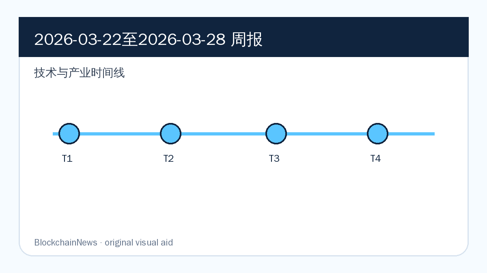
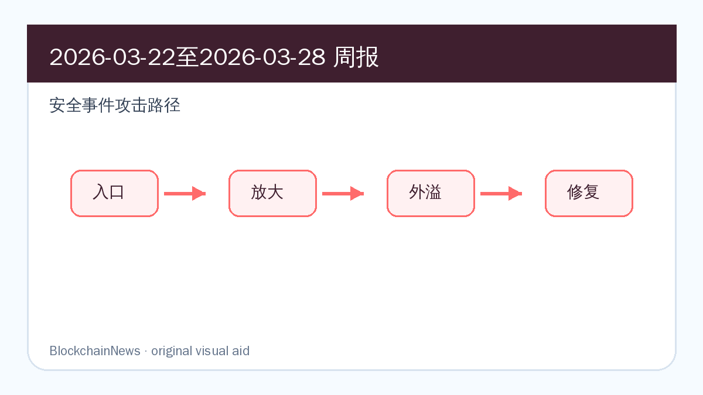
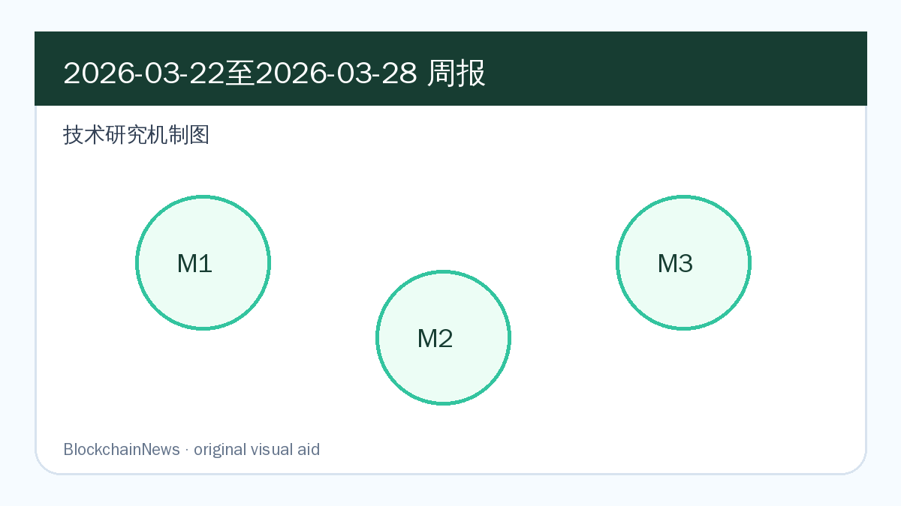

# 区块链周报（2026-03-22 至 2026-03-28）

## 导读

- stablecoin、Solana 开发者平台和 Sui 监控支持显示合规基础设施继续向多链扩张。
- Resolv 与 Xinbi 事件把 DeFi 权限密钥、诈骗保证市场和链上追踪能力放入同一安全主线。
- 技术研究从 AI 合约审计复测转向自托管安全、稳定币二级市场监控和生态系统报告。

*图：原创示意图，基于本期周报内容整理，用于辅助理解技术与产业时间线。*

*图：原创示意图，基于本期周报内容整理，用于辅助理解安全事件攻击路径。*

*图：原创示意图，基于本期周报内容整理，用于辅助理解技术研究机制。*

## 区块链技术与产业

### Chainalysis 接入 Solana Developer Platform，把 KYT 嵌入 AI-ready 开发环境

**来源：** [Chainalysis](https://www.chainalysis.com/blog/solana-developer-platform-real-time-compliance/) | 2026-03-24

Chainalysis 的原始材料把「Chainalysis 接入 Solana Developer Platform，把 KYT 嵌入 AI-ready 开发环境」放在链上数据、合规调查和机构工作流的交叉处：它提供的不是单一新闻点，而是一组可被交易所、钱包、银行或执法团队复用的链上观察信号。

工程层面，这类进展会改变基础设施团队的优先级：开发者要评估接口是否稳定，机构要评估托管、质押、KYT 或支付链路是否能纳入既有系统，协议方则要判断这些变化会不会改变用户流量和资产沉淀方式。

后续重点看项目方是否给出产品接口、客户端实现、治理提案或集成案例；如果只有概念发布而没有可复现技术细节，这条线索的权重应下调。

### Chainalysis 扩展 Sui 自动代币支持，多链调查工具覆盖对象型链生态

**来源：** [Chainalysis](https://www.chainalysis.com/blog/sui-automatic-token-support-march-2026/) | 2026-03-26

Chainalysis 的原始材料把「Chainalysis 扩展 Sui 自动代币支持，多链调查工具覆盖对象型链生态」放在链上数据、合规调查和机构工作流的交叉处：它提供的不是单一新闻点，而是一组可被交易所、钱包、银行或执法团队复用的链上观察信号。

工程层面，这类进展会改变基础设施团队的优先级：开发者要评估接口是否稳定，机构要评估托管、质押、KYT 或支付链路是否能纳入既有系统，协议方则要判断这些变化会不会改变用户流量和资产沉淀方式。

后续重点看项目方是否给出产品接口、客户端实现、治理提案或集成案例；如果只有概念发布而没有可复现技术细节，这条线索的权重应下调。

### Solana 与 Sui 合规覆盖扩张，提升多链机构可接入性

**来源：** [Chainalysis](https://www.chainalysis.com/blog/sui-automatic-token-support-march-2026/) | 2026-03-26

Chainalysis 的原始材料把「Solana 与 Sui 合规覆盖扩张，提升多链机构可接入性」放在链上数据、合规调查和机构工作流的交叉处：它提供的不是单一新闻点，而是一组可被交易所、钱包、银行或执法团队复用的链上观察信号。

工程层面，这类进展会改变基础设施团队的优先级：开发者要评估接口是否稳定，机构要评估托管、质押、KYT 或支付链路是否能纳入既有系统，协议方则要判断这些变化会不会改变用户流量和资产沉淀方式。

后续重点看项目方是否给出产品接口、客户端实现、治理提案或集成案例；如果只有概念发布而没有可复现技术细节，这条线索的权重应下调。

## 区块链安全

### Resolv Hack 显示单一密钥可在 DeFi 中铸出 2300 万美元风险

**来源：** [Chainalysis](https://www.chainalysis.com/blog/lessons-from-the-resolv-hack/) | 2026-03-22

Chainalysis 的原始材料把「Resolv Hack 显示单一密钥可在 DeFi 中铸出 2300 万美元风险」放在链上数据、合规调查和机构工作流的交叉处：它提供的不是单一新闻点，而是一组可被交易所、钱包、银行或执法团队复用的链上观察信号。

安全层面，风险往往不只来自一个合约函数。价格源、前端、权限密钥、签名授权、跨链消息和链上归因工具会同时参与风险传导；把它写入周报，是为了留下可复查的防御线索。

后续重点看攻击资金、补丁、审计报告和受影响用户统计是否更新；若复盘只停留在归因层面，仍需要等待更具体的根因和缓解措施。

### 英国制裁 Xinbi，打击中文 crypto 诈骗保证市场基础设施

**来源：** [Chainalysis](https://www.chainalysis.com/blog/xinbi-designation-chinese-language-crypto-scam-infrastructure/) | 2026-03-26

Chainalysis 的原始材料把「英国制裁 Xinbi，打击中文 crypto 诈骗保证市场基础设施」放在链上数据、合规调查和机构工作流的交叉处：它提供的不是单一新闻点，而是一组可被交易所、钱包、银行或执法团队复用的链上观察信号。

安全层面，风险往往不只来自一个合约函数。价格源、前端、权限密钥、签名授权、跨链消息和链上归因工具会同时参与风险传导；把它写入周报，是为了留下可复查的防御线索。

后续重点看攻击资金、补丁、审计报告和受影响用户统计是否更新；若复盘只停留在归因层面，仍需要等待更具体的根因和缓解措施。

### Solana 开发者平台嵌入 KYT，应用级 crypto 风控前移到构建阶段

**来源：** [Chainalysis](https://www.chainalysis.com/blog/solana-developer-platform-real-time-compliance/) | 2026-03-24

Chainalysis 的原始材料把「Solana 开发者平台嵌入 KYT，应用级 crypto 风控前移到构建阶段」放在链上数据、合规调查和机构工作流的交叉处：它提供的不是单一新闻点，而是一组可被交易所、钱包、银行或执法团队复用的链上观察信号。

安全层面，风险往往不只来自一个合约函数。价格源、前端、权限密钥、签名授权、跨链消息和链上归因工具会同时参与风险传导；把它写入周报，是为了留下可复查的防御线索。

后续重点看攻击资金、补丁、审计报告和受影响用户统计是否更新；若复盘只停留在归因层面，仍需要等待更具体的根因和缓解措施。

## 区块链与社会

### Xinbi 制裁体现英国把加密诈骗治理推向基础设施层

**来源：** [Chainalysis](https://www.chainalysis.com/blog/xinbi-designation-chinese-language-crypto-scam-infrastructure/) | 2026-03-26

Chainalysis 的原始材料把「Xinbi 制裁体现英国把加密诈骗治理推向基础设施层」放在链上数据、合规调查和机构工作流的交叉处：它提供的不是单一新闻点，而是一组可被交易所、钱包、银行或执法团队复用的链上观察信号。

社会与监管层面，这类消息说明加密资产不再只在交易场景里被讨论。司法管辖、制裁执行、消费者保护、AI 信息分发和银行合规都会反过来改变链上产品的设计边界。

后续重点看监管文本、执法行动或平台规则是否真正落地；如果只是会议发言或市场预期，需要和后续制度动作分开记录。

### stablecoin 项目进入执行阶段，银行关注指标、控制与监管互动

**来源：** [Chainalysis](https://www.chainalysis.com/blog/implementing-stablecoin-programs/) | 2026-03-22

Chainalysis 的原始材料把「stablecoin 项目进入执行阶段，银行关注指标、控制与监管互动」放在链上数据、合规调查和机构工作流的交叉处：它提供的不是单一新闻点，而是一组可被交易所、钱包、银行或执法团队复用的链上观察信号。

社会与监管层面，这类消息说明加密资产不再只在交易场景里被讨论。司法管辖、制裁执行、消费者保护、AI 信息分发和银行合规都会反过来改变链上产品的设计边界。

后续重点看监管文本、执法行动或平台规则是否真正落地；如果只是会议发言或市场预期，需要和后续制度动作分开记录。

### Solana Developer Platform 的合规集成改变开发者责任边界

**来源：** [Chainalysis](https://www.chainalysis.com/blog/solana-developer-platform-real-time-compliance/) | 2026-03-24

Chainalysis 的原始材料把「Solana Developer Platform 的合规集成改变开发者责任边界」放在链上数据、合规调查和机构工作流的交叉处：它提供的不是单一新闻点，而是一组可被交易所、钱包、银行或执法团队复用的链上观察信号。

社会与监管层面，这类消息说明加密资产不再只在交易场景里被讨论。司法管辖、制裁执行、消费者保护、AI 信息分发和银行合规都会反过来改变链上产品的设计边界。

后续重点看监管文本、执法行动或平台规则是否真正落地；如果只是会议发言或市场预期，需要和后续制度动作分开记录。

## 加密市场与宏观

### stablecoin 项目从战略进入执行，银行关注可衡量的支付改进

**来源：** [Chainalysis](https://www.chainalysis.com/blog/implementing-stablecoin-programs/) | 2026-03-22

Chainalysis 的原始材料把「stablecoin 项目从战略进入执行，银行关注可衡量的支付改进」放在链上数据、合规调查和机构工作流的交叉处：它提供的不是单一新闻点，而是一组可被交易所、钱包、银行或执法团队复用的链上观察信号。

市场层面，这类信号影响的是资金如何进入数字资产：ETF、企业财库、稳定币结算、矿企算力迁移和机构合规成本，都会改变 BTC、ETH 与 stablecoin 的定价叙事。

后续重点看资金流和链上使用是否同步。如果价格或融资数据没有对应的链上活跃度、储备披露或产品采用，宏观叙事可能很快退回短期波动。

### Sui token support 扩张提高多链资产机构可见性

**来源：** [Chainalysis](https://www.chainalysis.com/blog/sui-automatic-token-support-march-2026/) | 2026-03-26

Chainalysis 的原始材料把「Sui token support 扩张提高多链资产机构可见性」放在链上数据、合规调查和机构工作流的交叉处：它提供的不是单一新闻点，而是一组可被交易所、钱包、银行或执法团队复用的链上观察信号。

市场层面，这类信号影响的是资金如何进入数字资产：ETF、企业财库、稳定币结算、矿企算力迁移和机构合规成本，都会改变 BTC、ETH 与 stablecoin 的定价叙事。

后续重点看资金流和链上使用是否同步。如果价格或融资数据没有对应的链上活跃度、储备披露或产品采用，宏观叙事可能很快退回短期波动。

### Resolv 事件提醒市场重新定价 DeFi 离线权限风险

**来源：** [Chainalysis](https://www.chainalysis.com/blog/lessons-from-the-resolv-hack/) | 2026-03-22

Chainalysis 的原始材料把「Resolv 事件提醒市场重新定价 DeFi 离线权限风险」放在链上数据、合规调查和机构工作流的交叉处：它提供的不是单一新闻点，而是一组可被交易所、钱包、银行或执法团队复用的链上观察信号。

市场层面，这类信号影响的是资金如何进入数字资产：ETF、企业财库、稳定币结算、矿企算力迁移和机构合规成本，都会改变 BTC、ETH 与 stablecoin 的定价叙事。

后续重点看资金流和链上使用是否同步。如果价格或融资数据没有对应的链上活跃度、储备披露或产品采用，宏观叙事可能很快退回短期波动。

## 技术研究

### 《Re-Evaluating EVMBench: Are AI Agents Ready for Smart Contract Security?》

- 原文链接：https://arxiv.org/abs/2603.10795
- 原始发表：2026-03-11
- 摘要速写：EVMBench 复测研究用真实事件与不同 scaffold 比较 AI agent 表现，指出智能合约安全自动化仍强依赖评测设计。
- 核心贡献：
  - 明确研究对象与 blockchain / Ethereum / DeFi / stablecoin 系统边界，避免把泛安全议题误放进技术研究。
  - 拆分协议机制、攻击路径、链上数据或合规流程之间的因果关系。
  - 给开发者、安全团队、研究者或机构采用方提供可继续验证的技术问题清单。

#### 背景与问题

Re-Evaluating EVMBench 被放入技术研究，不是因为标题里出现了区块链关键词，而是因为它直接触及链上系统的一个可验证问题：排序公平性、合约分析、身份与钱包、资金追踪、MEV、stablecoin 监控或机构级合规工作流。周报关注的是这些问题如何在真实协议和真实用户路径中发生，而不是只复述 abstract。

#### 方法/机制

原文的价值在于把研究对象拆成可操作的机制：要么用链上数据或图模型观察行为，要么用算法、审计框架、合规流程或市场结构解释风险如何形成。阅读时需要同时看三个层面：数据从哪里来，假设是否贴近主网或生产环境，结论能否被钱包、审计、交易路由、KYT 或治理流程吸收。

#### 关键发现

最值得保留的发现，是它把单点问题放回了系统结构中：协议设计会影响经济激励，链上数据质量会影响调查结论，工具链能力会影响开发者能否发现风险。对周报读者来说，这类研究的意义在于提供一个可迁移的分析框架，而不是只给出某个样本上的分数。

#### 局限与后续

后续应优先检查原文是否公开代码、数据集、复现实验或反驳材料，并观察项目方是否把结论转化为客户端补丁、审计规则、钱包提示、KYT 策略或治理提案。若缺少可复现材料，它更适合作为问题线索，而不是直接升级为行业结论。

### 《Not Your Keys, Not Your Coins: What True Self-Custody Actually Requires》

- 原文链接：https://cointelegraph.com/research/not-your-keys-not-your-coins-what-true-self-custody-actually-requires
- 原始发表：2026-03-12
- 摘要速写：自托管研究报告把区块链 wallet recovery、签名可读性、MPC 与硬件设备放入同一框架，解释真实自托管为何不等于单独保管助记词。
- 核心贡献：
  - 明确研究对象与 blockchain / Ethereum / DeFi / stablecoin 系统边界，避免把泛安全议题误放进技术研究。
  - 拆分协议机制、攻击路径、链上数据或合规流程之间的因果关系。
  - 给开发者、安全团队、研究者或机构采用方提供可继续验证的技术问题清单。

#### 背景与问题

Not Your Keys, Not Your Coins 被放入技术研究，不是因为标题里出现了区块链关键词，而是因为它直接触及链上系统的一个可验证问题：排序公平性、合约分析、身份与钱包、资金追踪、MEV、stablecoin 监控或机构级合规工作流。周报关注的是这些问题如何在真实协议和真实用户路径中发生，而不是只复述 abstract。

#### 方法/机制

原文的价值在于把研究对象拆成可操作的机制：要么用链上数据或图模型观察行为，要么用算法、审计框架、合规流程或市场结构解释风险如何形成。阅读时需要同时看三个层面：数据从哪里来，假设是否贴近主网或生产环境，结论能否被钱包、审计、交易路由、KYT 或治理流程吸收。

#### 关键发现

最值得保留的发现，是它把单点问题放回了系统结构中：协议设计会影响经济激励，链上数据质量会影响调查结论，工具链能力会影响开发者能否发现风险。对周报读者来说，这类研究的意义在于提供一个可迁移的分析框架，而不是只给出某个样本上的分数。

#### 局限与后续

后续应优先检查原文是否公开代码、数据集、复现实验或反驳材料，并观察项目方是否把结论转化为客户端补丁、审计规则、钱包提示、KYT 策略或治理提案。若缺少可复现材料，它更适合作为问题线索，而不是直接升级为行业结论。

### 《Assessing FATF Stablecoin Secondary-Market Monitoring》

- 原文链接：https://www.chainalysis.com/blog/fatf-targeted-report-secondary-market-monitoring-stablecoins-march-2026/
- 原始发表：2026-03-11
- 摘要速写：FATF stablecoin 分析把监管焦点从发行与赎回扩展到 P2P 二级市场，解释 issuer 和 VASP 为什么需要多跳链上监控。
- 核心贡献：
  - 明确研究对象与 blockchain / Ethereum / DeFi / stablecoin 系统边界，避免把泛安全议题误放进技术研究。
  - 拆分协议机制、攻击路径、链上数据或合规流程之间的因果关系。
  - 给开发者、安全团队、研究者或机构采用方提供可继续验证的技术问题清单。

#### 背景与问题

Assessing FATF Stablecoin Secondary-Market Monitoring 被放入技术研究，不是因为标题里出现了区块链关键词，而是因为它直接触及链上系统的一个可验证问题：排序公平性、合约分析、身份与钱包、资金追踪、MEV、stablecoin 监控或机构级合规工作流。周报关注的是这些问题如何在真实协议和真实用户路径中发生，而不是只复述 abstract。

#### 方法/机制

原文的价值在于把研究对象拆成可操作的机制：要么用链上数据或图模型观察行为，要么用算法、审计框架、合规流程或市场结构解释风险如何形成。阅读时需要同时看三个层面：数据从哪里来，假设是否贴近主网或生产环境，结论能否被钱包、审计、交易路由、KYT 或治理流程吸收。

#### 关键发现

最值得保留的发现，是它把单点问题放回了系统结构中：协议设计会影响经济激励，链上数据质量会影响调查结论，工具链能力会影响开发者能否发现风险。对周报读者来说，这类研究的意义在于提供一个可迁移的分析框架，而不是只给出某个样本上的分数。

#### 局限与后续

后续应优先检查原文是否公开代码、数据集、复现实验或反驳材料，并观察项目方是否把结论转化为客户端补丁、审计规则、钱包提示、KYT 策略或治理提案。若缺少可复现材料，它更适合作为问题线索，而不是直接升级为行业结论。

## 后续关注

- 跟踪 Ethereum、Rollup、stablecoin、DeFi 安全和链上情报主线是否出现新的官方公告或事故复盘。
- 对安全事件只报道新增事实，避免把同一资金流、同一漏洞复盘或同一研究链接重复包装成新事件。
- 技术研究优先回到原文、数据集和代码仓库，确认是否有后续版本、复测或反驳。
