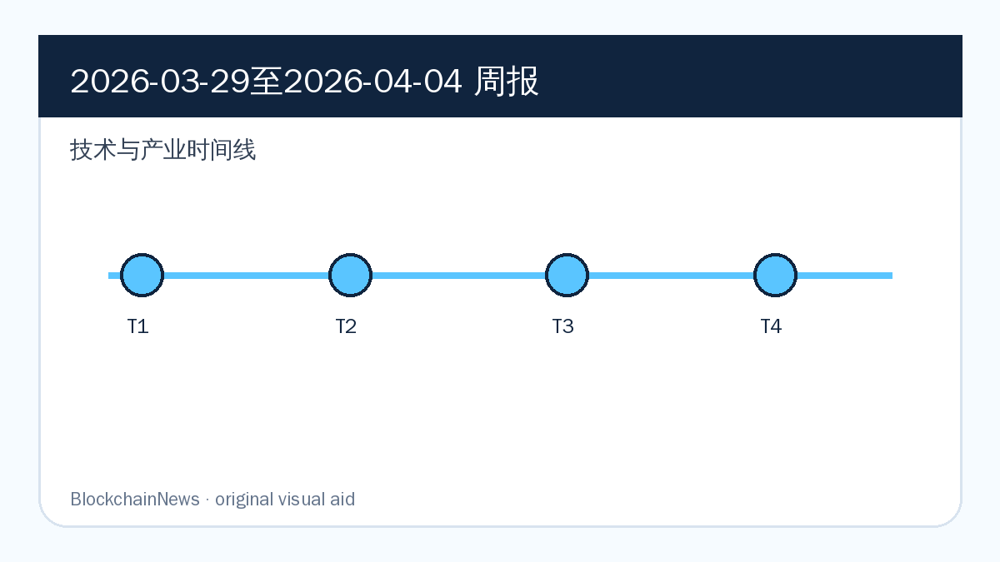
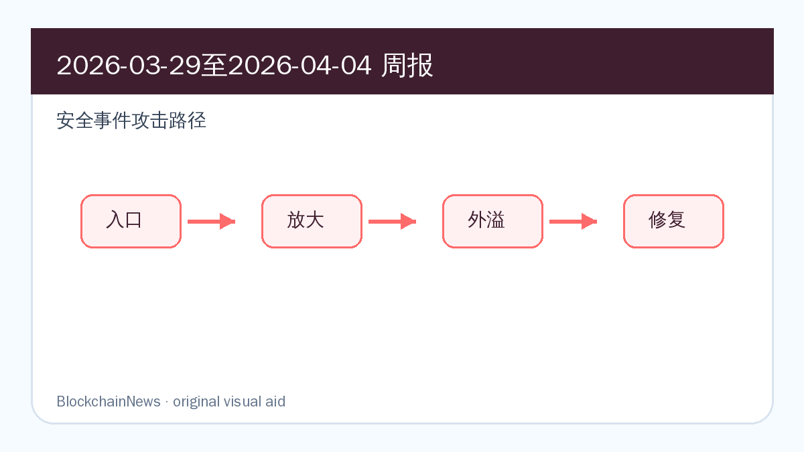
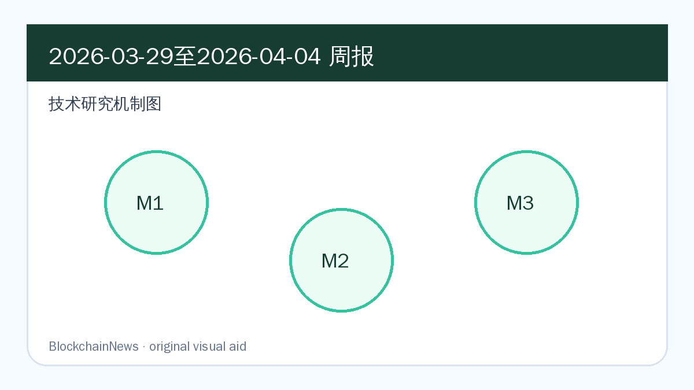

# 区块链周报（2026-03-29 至 2026-04-04）

## 导读

- Chainalysis Links NYC 2026 把 AI agent、TradFi convergence 和 networked intelligence 设为本周关键词。
- Tempo 自动 token coverage 显示稳定币支付链正在被纳入企业级合规监控。
- 安全主题集中在 AI 放大诈骗、无人机采购链上资金和制裁网络追踪。

*图：原创示意图，基于本期周报内容整理，用于辅助理解技术与产业时间线。*

*图：原创示意图，基于本期周报内容整理，用于辅助理解安全事件攻击路径。*

*图：原创示意图，基于本期周报内容整理，用于辅助理解技术研究机制。*

## 区块链技术与产业

### Tempo 自动代币覆盖凸显 stablecoin payment chain 工程化

**来源：** [Chainalysis](https://www.chainalysis.com/blog/tempo-automatic-token-coverage-march-2026/) | 2026-03-30

Tempo 进入 Chainalysis 自动代币覆盖范围后，稳定币支付链的竞争点从“是否能低成本转账”进一步转向“企业是否能在上线第一天获得可审计的链上可见性”。对支付链来说，这类覆盖意味着代币、地址与交易活动可以更快进入 KYT、调查和合规工作台。

工程上，Tempo 这类支付导向链需要同时满足吞吐、memo/业务语义、风控接口和企业后台对账。自动覆盖降低的是机构接入门槛：银行或支付公司不用先自建完整索引与标签体系，就能把新链交易纳入监控、告警和报表流程。

后续看 Tempo 是否披露更多资产覆盖、稳定币发行方接入和企业 API 细节；如果支付链只能展示结算速度，却无法给出合规可观测性，它在机构场景里的优势会很快被削弱。

### Chainalysis blockchain intelligence agents 将链上调查流程推向自动化

**来源：** [Chainalysis](https://www.chainalysis.com/blog/introducing-first-blockchain-intelligence-agents-2026/) | 2026-03-31

Chainalysis 发布 blockchain intelligence agents，核心变化是把链上调查从“人工查询工具”推向“可调用的任务型工作流”。这类 agent 并不是替代分析员，而是把地址归因、交易路径展开、风险标签和报告草稿组合成更连续的调查链。

机制上，它依赖的是 Chainalysis 已积累的实体图谱、地址聚类和跨链资金流追踪，再叠加 AI 对调查步骤的编排能力。对交易所合规团队而言，价值在于缩短从可疑交易到可读结论的时间；对执法场景而言，则是把重复性路径追踪标准化。

后续需要观察它在误报、可解释性和审计留痕上的处理方式。链上情报一旦进入自动化，真正的难题会从“能不能找到路径”变成“能不能证明这条路径足够可靠”。

### Links NYC 2026：TradFi convergence 成为 digital asset 基础设施主线

**来源：** [Chainalysis](https://www.chainalysis.com/blog/links-2026-recap/) | 2026-04-02

Chainalysis Links NYC 2026 的复盘把 TradFi convergence 放在中心位置，说明数字资产基础设施正在从加密原生工具迁移到银行、支付和监管团队能理解的工作流。会议主线不只是“机构看好 crypto”，而是传统金融开始要求更标准化的链上数据、风险控制和资产流转接口。

这一变化会影响公链和中间件的评价标准。机构采用不只看 TPS 或费用，还会看交易监控、地址筛查、稳定币对账、审计留痕和跨团队协作能否接入现有金融系统。换句话说，合规与数据层正在变成基础设施的一部分。

后续应跟踪会议主题是否转化为产品和合作：银行 stablecoin 项目、链上情报 API、调查 agent、以及多链 token coverage 的实际部署，都会决定这条叙事是否真正落地。

## 区块链安全

### Chainalysis agents 聚焦 AI 放大 crypto fraud 与链上调查自动化

**来源：** [Chainalysis](https://www.chainalysis.com/blog/introducing-first-blockchain-intelligence-agents-2026/) | 2026-03-31

AI 同时改变攻击与防守两端：诈骗团伙可以用自动化内容、深伪沟通和更高频的社工触达扩大受害面，调查团队则尝试用 blockchain intelligence agents 缩短识别、归因和报告周期。本周这个安全信号的重点正是这种攻防速度差。

安全机制上，agent 的价值不在于“自动给结论”，而在于把地址筛查、资金流路径、实体标签和风险解释串成可复用流程。它能够帮助分析员更快找到可疑节点，但仍需要人工复核来处理误归因、跨链桥跳转和混币服务造成的不确定性。

后续看这些 agent 是否能输出可审计的证据链，以及交易所和钱包是否把相关能力前置到用户交互层。如果只停留在后台调查，它对实时止损的作用会有限。

### 无人机采购链上资金研究显示 sanctions evasion 与 crypto rails 交织

**来源：** [Chainalysis](https://www.chainalysis.com/blog/cryptocurrency-drones-research/) | 2026-03-30

Chainalysis 对无人机采购资金的研究，把链上 stablecoin 支付、供应商地址和受制裁网络放在同一张图里。它说明加密资产在地缘冲突中不只是避险工具，也可能成为采购链、灰色贸易和制裁规避的支付轨道。

这类分析的技术含量在于把链上资金流与链下商品、价格和供应商信息互相校验。单看一个地址并不能证明采购网络，但当交易模式、产品价格、供应商身份和资金来源持续重合时，链上情报就能为制裁执行提供更高置信度的线索。

后续需要观察执法机构、交易平台和 stablecoin 发行方如何处理这类网络：是冻结明确地址、扩大筛查规则，还是把相关模式纳入更实时的风险评分。

### Links 2026 复盘强调 AI 同时放大 crypto 攻击和防守能力

**来源：** [Chainalysis](https://www.chainalysis.com/blog/links-2026-recap/) | 2026-04-02

Links NYC 2026 把 AI amplification 放到 crypto 风险讨论中，强调 AI 不只是提高调查效率，也会放大诈骗、钓鱼和身份伪造能力。这个判断把安全焦点从单个漏洞，扩展到用户触达、内容生成和交易诱导链路。

技术上，AI 放大风险会改变钱包与交易所的防护优先级：签名预览、地址风险提示、异常交互阻断和诈骗内容识别都需要更贴近实时交易。单纯依赖用户教育已经不够，因为攻击者可以规模化生成更有说服力的诱导内容。

后续重点看安全厂商是否把 AI 风险信号接入链上风控，而不是只发布宏观趋势报告。真正有价值的进展会体现为更低误报、更快拦截和更清晰的用户提示。

## 区块链与社会

### Chainalysis Links NYC 把 crypto 讨论放入地缘政治和宏观金融框架

**来源：** [Chainalysis](https://www.chainalysis.com/blog/links-2026-recap/) | 2026-04-02

Links NYC 2026 的议题设置显示，crypto 已被放进更大的地缘政治和宏观金融框架中讨论。stablecoin、制裁执行、跨境支付和机构合规不再是分散话题，而是共同构成数字资产进入传统金融系统的现实约束。

社会层面的变化在于，链上数据开始成为公共治理工具。它既服务反诈、制裁和执法，也会影响隐私边界、平台责任和金融机构能否在合规前提下进入数字资产业务。

后续看监管机构是否与链上分析公司形成更固定的数据协作机制；一旦这种协作常态化，用户隐私、数据透明和执法效率之间的张力会继续上升。

### 无人机融资研究把 crypto 纳入战争与制裁治理议题

**来源：** [Chainalysis](https://www.chainalysis.com/blog/cryptocurrency-drones-research/) | 2026-03-30

无人机采购研究把 crypto 明确拉入战争融资与制裁治理议题。它提醒市场，stablecoin 的全球流动性既可以服务合规支付，也可能被用在灰色采购、跨境转移和受制裁供应链中。

这类议题的治理难点在于资金流本身并不总是违法信号，必须与供应商、商品类别、地理位置和交易上下文一起解释。链上透明性提供了调查入口，但也会带来误伤、过度筛查和跨司法辖区执法协调问题。

后续应关注 stablecoin 发行方和交易平台是否公布更具体的筛查规则，以及这些规则是否会影响普通跨境支付、OTC 市场和高风险地区的用户可用性。

### stablecoin 规模化讨论要求金融机构同步建设风险控制

**来源：** [Chainalysis](https://www.chainalysis.com/blog/links-2026-recap/) | 2026-04-02

Links NYC 2026 对 stablecoin 规模化的讨论，重点已经从“稳定币是否会进入主流支付”转向“金融机构如何安全接入”。这意味着风控、储备透明、交易监控和客户资金流解释，正在成为 stablecoin 产品设计的一部分。

社会与制度层面，稳定币越接近银行和企业支付系统，就越需要对接反洗钱、制裁筛查、争议处理和审计机制。单纯强调链上结算效率，无法回答监管者和企业财务部门真正关心的问题。

后续看银行和支付公司是否推出可验证的 stablecoin 项目，而不只是战略表态。是否能提供清晰储备、赎回、监控和报表接口，会决定其落地速度。

## 加密市场与宏观

### stablecoin 每日结算规模强化数字资产宏观基础设施叙事

**来源：** [Chainalysis](https://www.chainalysis.com/blog/links-2026-recap/) | 2026-04-02

Links NYC 2026 继续把 stablecoin 的每日结算规模作为数字资产宏观叙事的证据。这里的重点不是单次交易量，而是稳定币逐渐成为跨境支付、交易所流动性和企业资金调拨的公共结算层。

宏观层面，stablecoin 会把美元流动性、交易所资金周转和链上 DeFi 活跃度连接起来。规模越大，市场越需要关注发行方储备、赎回压力、链上拥堵和监管响应对整体流动性的影响。

后续看交易量是否来自真实支付和企业结算，而不是主要由交易所和套利活动贡献。这个区分会影响 stablecoin 叙事的可持续性。

### Tempo 支付链上线后进入合规监控，stablecoin 基础设施竞争升温

**来源：** [Chainalysis](https://www.chainalysis.com/blog/tempo-automatic-token-coverage-march-2026/) | 2026-03-30

Tempo 被纳入自动代币覆盖，让稳定币支付链竞争多了一个宏观维度：谁能最快把链上交易转化成企业可用的风险与合规数据。对资金方来说，这比单纯宣传低费用更贴近实际采用。

市场影响在于，支付链的价值会越来越多体现在综合基础设施能力上：稳定币发行、商户接入、交易监控、审计报表和跨境结算 SLA 都会共同决定资本与企业客户是否愿意迁移。

后续看 Tempo 是否吸引更多发行方和支付伙伴；如果 token coverage 与企业接口同步扩张，它可能成为稳定币支付链竞争中的一个参考样板。

### Blockchain intelligence agents 可能压缩 crypto 调查与合规成本

**来源：** [Chainalysis](https://www.chainalysis.com/blog/introducing-first-blockchain-intelligence-agents-2026/) | 2026-03-31

Chainalysis agents 对市场的潜在影响，是压缩调查和合规团队处理可疑交易的边际成本。若自动化流程能减少人工路径追踪时间，交易所、银行和支付公司接入 crypto 的运营成本也会随之下降。

宏观上，这会影响机构采用的成本曲线。过去很多机构不是看不懂数字资产，而是担心监控、审计、误报和监管沟通成本过高；调查 agent 如果能稳定输出可复核结果，就可能降低这类摩擦。

后续看收费模式、误报率和审计能力。如果 agent 只能生成解释性文本而不能保留证据链，它对机构成本的改善会被合规复核重新吃掉。

## 技术研究

### 《Chainalysis Introduces the First Blockchain Intelligence Agents》

- 原文链接：https://www.chainalysis.com/blog/introducing-first-blockchain-intelligence-agents-2026/
- 原始发表：2026-03-31
- 摘要速写：Chainalysis agents 技术分析把链上实体图谱、确定性调查流程和 AI 辅助推理组合成高风险合规场景的自动化框架。
- 核心贡献：
  - 把链上实体图谱、地址聚类和调查步骤封装为可调用 agent，降低高频调查任务的人工编排成本。
  - 将 AI 辅助推理放在确定性链上数据之后，强调证据链、解释性和人工复核，而不是让模型直接替代归因判断。
  - 为交易所、执法机构和合规团队提供了一个从告警到报告的自动化工作流样板。

#### 背景与问题

AI 正在同时提升 crypto 诈骗效率和调查团队的处理压力。Chainalysis 的问题意识是：链上调查不缺查询工具，缺的是能把地址、实体、交易路径和风险解释串起来的可复用流程。

#### 方法/机制

其机制更接近“调查工作流自动化”而不是通用聊天机器人。agent 需要调用既有实体图谱、KYT 标签、跨链路径追踪和风险上下文，再把中间步骤组织成分析员可以审计的结论。

#### 关键发现

关键发现是，AI 在链上情报中的价值主要来自任务编排和证据整理。它可以压缩重复查询时间，但归因置信度仍依赖底层数据质量、实体标签和人工复核。

#### 局限与后续

局限在于公开材料仍偏产品说明，缺少误报率、复杂跨链场景和对抗性样本的量化评估。后续应关注其是否公开更细的审计日志、评测指标和真实客户案例。

### 《From the Battlefield to the Blockchain: How Cryptocurrency Is Helping Finance the Drone Revolution》

- 原文链接：https://www.chainalysis.com/blog/cryptocurrency-drones-research/
- 原始发表：2026-03-30
- 摘要速写：无人机融资研究把商品价格、供应商地址和 stablecoin 资金流合并为 sanctions evasion 分析方法，展示链上数据如何识别军工采购网络。
- 核心贡献：
  - 把 stablecoin 资金流、供应商地址、商品价格和链下采购线索结合起来，形成制裁规避网络的多证据分析框架。
  - 说明链上数据可以帮助识别军工供应链融资，而不是只用于交易所 AML 或 DeFi 事故追踪。
  - 把无人机采购场景纳入 crypto 风险评估，为 stablecoin 发行方和交易平台提供更具体的筛查对象。

#### 背景与问题

这篇分析关注的是 crypto rails 如何进入军工采购和制裁规避网络。单笔链上交易通常无法说明资金用途，但当交易地址、供应商、产品价格和受制裁实体持续重合时，链上数据就能形成更强的调查线索。

#### 方法/机制

方法上，它把链上交易路径与链下公开信息结合：先识别可疑供应商和收款地址，再观察 stablecoin 流入、资金来源和交易对手方，最后把资金流与无人机零部件采购叙事对齐。

#### 关键发现

关键发现是，稳定币的低摩擦跨境转移能力正在被高风险采购网络利用；同时，公开链也为执法和合规团队提供了追踪资金路径的窗口。

#### 局限与后续

局限在于链下身份和资金用途仍需外部证据支撑。后续应观察制裁名单、交易所冻结和 stablecoin 发行方黑名单是否跟进，以及这些措施是否引发更复杂的规避路径。

### 《Chainalysis Links NYC 2026: AI Amplification, TradFi Convergence, and Networked Intelligence》

- 原文链接：https://www.chainalysis.com/blog/links-2026-recap/
- 原始发表：2026-04-02
- 摘要速写：Links NYC 2026 技术复盘把 blockchain intelligence、AI amplification、TradFi convergence 和 networked intelligence 放入同一框架，解释链上情报如何进入数字资产金融基础设施。
- 核心贡献：
  - 把 AI amplification、TradFi convergence 和 networked intelligence 三条主题并列，描绘数字资产基础设施进入机构工作流的方向。
  - 强调链上情报不再只是事后调查工具，而会成为银行、支付、合规和执法协作的常驻数据层。
  - 为周报提供了判断行业基础设施成熟度的框架：合规可观测性、自动化调查和机构系统集成要一起看。

#### 背景与问题

Links NYC 2026 的价值不在于会议本身，而在于它把 AI、传统金融接入和链上情报网络放到同一张路线图里。这个框架有助于判断 crypto 基础设施是否正在从加密原生工具变成金融机构的操作系统组件。

#### 方法/机制

方法上，复盘文章用会议议题和行业案例串联趋势：AI 负责放大风险与防御能力，TradFi convergence 解释机构接入需求，networked intelligence 则指向跨组织、跨链的数据协作。

#### 关键发现

关键发现是，机构化采用不再只取决于资产价格或监管态度。能否提供可审计、可解释、可集成的链上情报能力，正在成为 stablecoin、交易所和公链基础设施竞争的一部分。

#### 局限与后续

局限在于会议复盘天然偏趋势判断，缺少逐项量化指标。后续要看这些主题是否落实为 API、产品合作、监管协作或公开案例，而不是停留在行业叙事层面。

## 后续关注

- 跟踪 Ethereum、Rollup、stablecoin、DeFi 安全和链上情报主线是否出现新的官方公告或事故复盘。
- 对安全事件只报道新增事实，避免把同一资金流、同一漏洞复盘或同一研究链接重复包装成新事件。
- 技术研究优先回到原文、数据集和代码仓库，确认是否有后续版本、复测或反驳。
