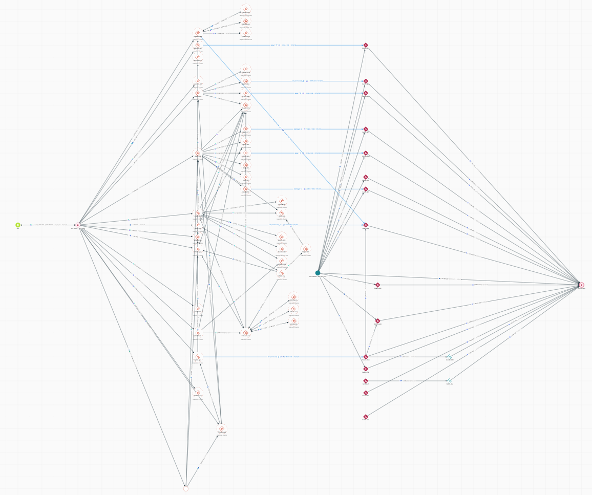

# Drift协议被利用，涉嫌与朝鲜有关联的攻击，损失2.86亿美元

- 原文链接：https://www.elliptic.co/blog/drift-protocol-exploited-for-286-million-in-suspected-dprk-linked-attack
- 来源：Elliptic
- 作者/机构：Elliptic
- 原始发布时间：2026-04-02
- 仅供个人学习：本文为获得转载授权后的中文译文，请以英文原文为准。

图：原文标题图
来源：Elliptic，《Drift Protocol exploited for $286 million in suspected DPRK-linked attack》

本文于 4 月 7 日更新，以反映对此次事件调查的新进展。

Elliptic 已识别出多项迹象，表明对 Drift Protocol 的这次利用事件与朝鲜民主主义人民共和国有关联。

Drift Protocol 是 Solana 区块链上最大的去中心化永续期货交易所。2026 年 4 月 1 日，该协议发生了一起重大安全事件。Elliptic 计算得出，此次利用事件中被盗资产的总价值为 2.86 亿美元。与此次攻击相关的链上行为、洗钱方法以及网络层指标，与此前被归因于朝鲜的攻击行动中观察到的技术手法一致。

4 月 5 日，Drift Protocol 在 X 上发布更新称，基于 SEAL 911 团队完成的调查，并以中高置信度判断，“此次行动被评估为与 2024 年 10 月 Radiant Capital 黑客事件背后相同的威胁行为者所实施。该事件曾被 Mandiant 归因于 UNC4736，这是一个与朝鲜国家有关联的组织，也被跟踪为 AppleJeus 或 Citrine Sleet……如果你的团队认为自己可能遭到了同一组织或类似行动的针对，请立即联系 @SEAL911。”

这是 Elliptic 今年追踪到的第 18 起与朝鲜有关联的事件，迄今被盗金额已超过 3 亿美元。这也是朝鲜长期开展大规模加密资产盗窃行动的延续。美国政府已将这类活动与其武器项目融资联系起来。近些年来，被认为与朝鲜有关联的行为者已经窃取了超过 65 亿美元的加密资产。

这起最新事件还发生在与朝鲜有关联的攻击活动整体升级的背景下。近期，攻击者还曾针对加密生态发动更广泛的供应链攻击，例如 Axios npm 软件包遭到入侵，Google 将该事件归因于另一名朝鲜威胁行为者 UNC1069。

## Drift Protocol 攻击是如何发生的？

在攻击开始后的一个小时内，攻击者通过从多个协议金库中提取资产，系统性地抽走了 Drift 绝大部分流动性。根据区块链安全公司 PeckShield 的说法，初步原因似乎是协议管理员私钥遭到攻破，使攻击者获得了特权访问权限，从而能够发起提款并更改管理控制。

攻击者瞄准了三个核心金库：JLP Delta Neutral、SOL Super Staking 和 BTC Super Staking 金库。最大的一笔单笔转账涉及大约 4170 万枚 JLP 代币，按被盗时的价格计算约值 1.55 亿美元。其他被盗资产还包括 USDC、SOL、cbBTC、wBTC、流动性质押代币以及其他资产。

根据 DefiLlama 的数据，攻击发生后，Drift 的总锁仓价值（TVL）从约 5.5 亿美元骤降至不足 2.5 亿美元。这使其成为 2026 年迄今为止规模最大的 DeFi 黑客事件，也是 Solana 生态中继 2022 年 3.26 亿美元 Wormhole 跨链桥攻击事件之后第二大的安全事件。

Drift 团队在 X 上确认了这次利用事件，称 Drift Protocol 正遭受“主动攻击”，并已暂停充值和提现。团队还表示，正在与多家安全公司、跨链桥和交易所协调，以控制事件影响。

4 月 5 日，Drift Protocol 发布了初步调查结果，详细说明攻击者此前筹划了一场“需要组织支持、大量资源以及数月蓄意准备的情报行动”。

## 被盗资金追踪

链上数据显示，攻击者的钱包大约在此次利用发生前八天创建，并在此期间从 Drift 的一个金库收到过一笔小额测试转账，这表明此次行动经过预谋，并经过谨慎铺排。

在抽走金库资产之后，攻击者主要使用基于 Solana 的 DEX 聚合器，迅速将被盗代币兑换为 USDC。随后，这些资金被桥接到以太坊区块链，在那里又被兑换成 ETH。

借助 Elliptic Investigator 及其整体化的跨链追踪能力，可以从 Solana 上最初发生的利用事件，一路追踪资金流向，直到攻击者目前在以太坊上的持仓。

图：Drift Protocol 被盗资金流向图
来源：Elliptic Investigator

Elliptic 的情报团队将继续监控这些被盗资金的流动，并会在有新信息时更新本文。

## Elliptic 如何提供帮助

Elliptic 已采取紧急措施，确保与此次利用事件相关的地址能够通过其整体化区块链分析解决方案被筛查和追踪。客户可以据此确保自己不会在无意中处理来自实施此次盗窃的实体或个人的资金，或将资金发送给他们。

由于攻击者从多个金库中抽走了超过 15 种代币，想要在 Solana 上追踪此次事件的完整范围，就需要理解该网络如何组织链上活动。Solana 的架构会为同一实体持有的每一种资产分别创建独立的代币账户，这意味着攻击者窃取的 JLP、USDC、SOL、cbBTC 以及其他资产，分别位于不同的链上地址中。

如果分析服务商将这些地址视为彼此无关，那么他们看到的将只是攻击者活动的碎片，而不是完整图景。

Elliptic 的 Solana 高级聚类功能会自动把主账户与所有相关代币账户连接起来，因此无论筛查的是哪一个地址，都能获得完整实体层面的可见性。当你筛查攻击者控制的任意地址时，Elliptic 都会识别出全部相关地址，并返回针对该完整实体的风险情报。

对于这类被盗资金横跨多种资产类型、且攻击者正在积极把资金分散到多个钱包和多条区块链上的事件来说，这一点至关重要。

结合 Elliptic 业内领先、覆盖超过 65 条区块链的能力，这些功能确保当前已经观察到的洗钱路径，无论是从 Solana 到 Ethereum，还是更远的后续流转，都仍然可以被完整追踪。因此，任何相关风险或与虚拟资产服务提供商的风险暴露，都可以在接近实时的情况下被识别出来。

如果你希望了解 Elliptic 如何帮助你的机构筛查与此次事件及其他高影响力利用事件相关的风险敞口，可以联系 Elliptic 团队。
